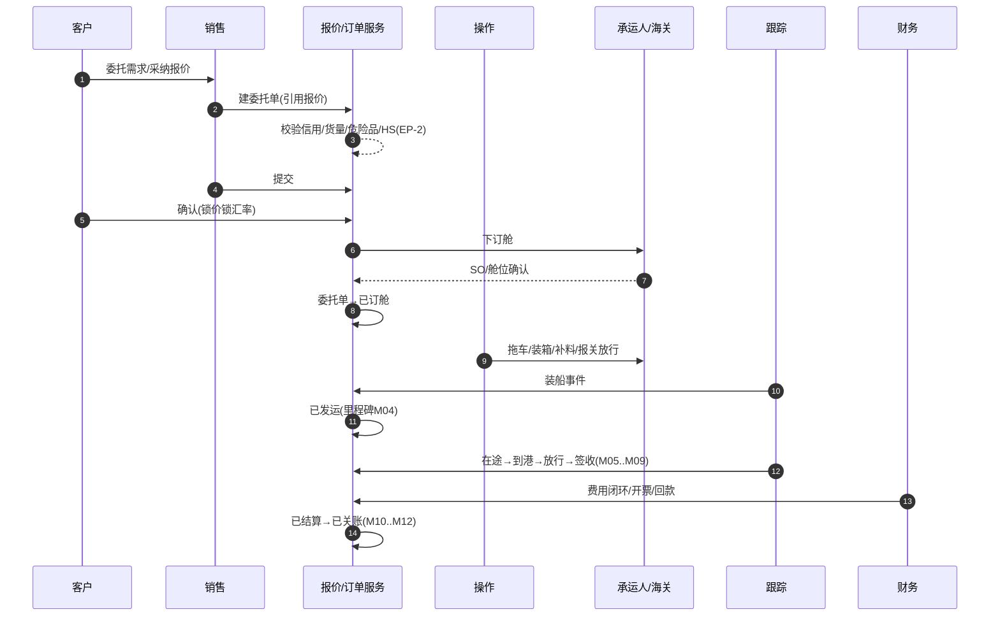
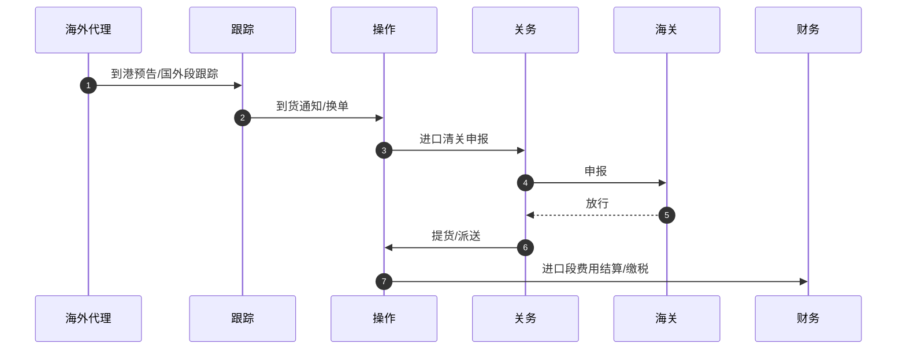
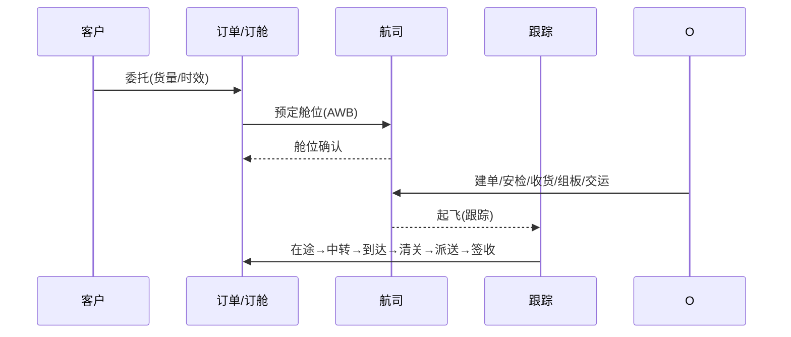
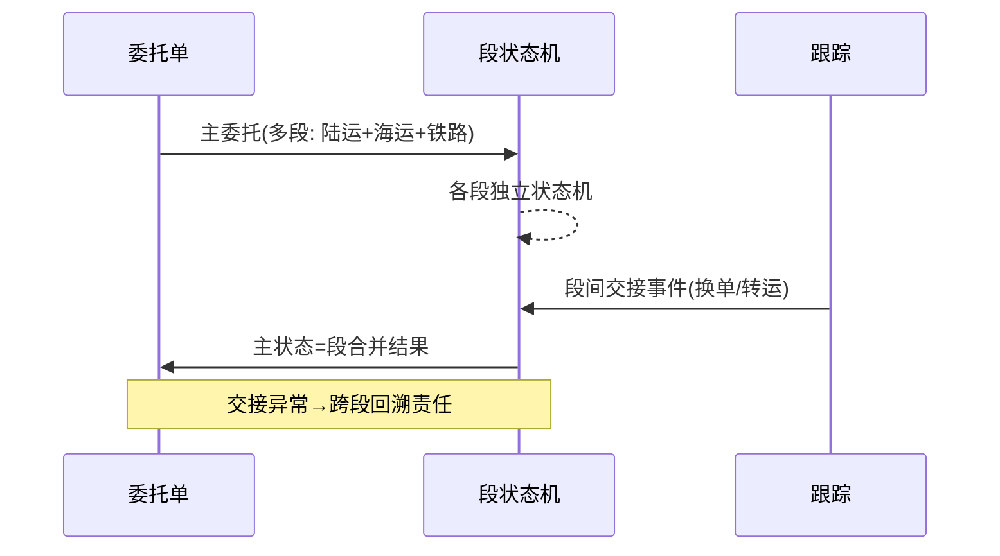
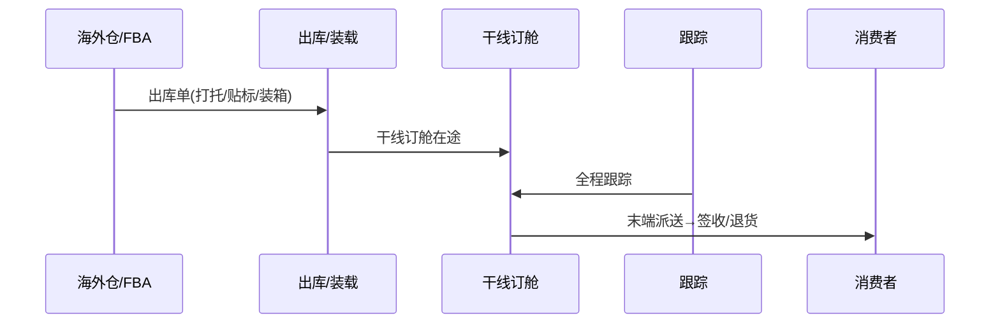
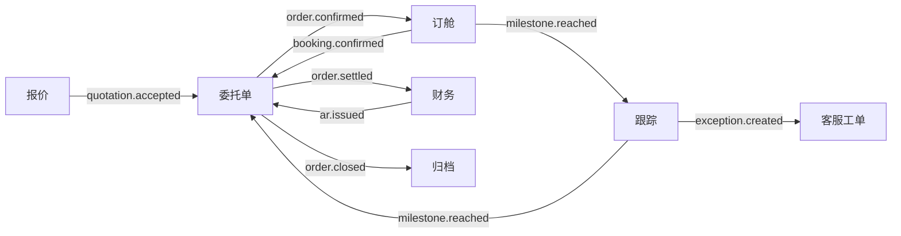

# 端到端时序图汇总 v4.0

> 汇总第二轮各模块时序，供评审展示。以下时序为 Mermaid 源码，可直接渲染。
> 协作图统一缩写：客户/门户=C，销售=S，操作=O，关务=CS，仓储=W，财务=F，系统服务=SV，外部承运/海关/代理=EXT，跟踪=TRK。

---

## 一、海运出口 FCL 全链路

## 二、海运进口全链路

## 三、空运出口全链路

## 四、多式联运（段式）

## 五、电商小包（仓+干线）

## 六、跨模块事件闭环示意

---

> 图中角色与事件与前序文档一致；完整分模块时序见各 `-v4.0` 文档「端到端时序图」小节。
