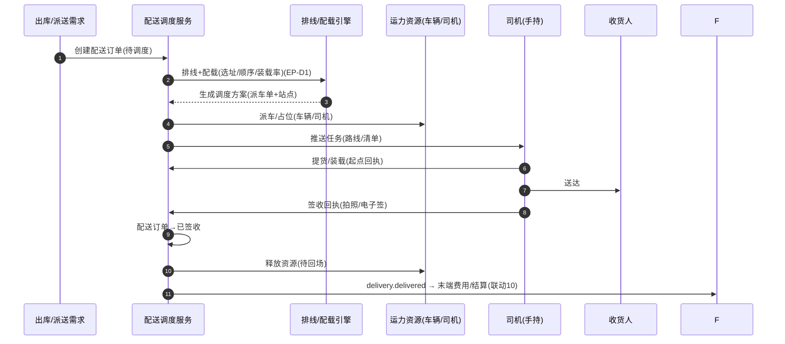

# 配送调度（Delivery Dispatch）深化设计 v4.0

> 针对 `19-物流七大功能覆盖对照` 中的缺口「配送调度（运力/线路/配载/路径优化）」补齐。
> 依据：`13-第二轮深化设计-总览` 模板；与 `06-订舱操作`、`09-仓储WMS`、`19` 衔接。

---

## 一、目标与范围再确认

配送是"末端物流服务"（七大功能之六），本模块补齐**调度与履约**层：把派送需求翻译为"派车单 + 排线 + 配载 + 签收回执"，并管理运力资源（车辆/司机/承运人运力）。

**边界**
- 属于配送调度：配送订单、运力资源、排线/配载、派车与在途、签收回执。
- 不属于：干线运输（`06-订舱操作`）、仓内作业（`09-仓储WMS`）、运费结算（`10-财务`）——本模块只产出履约事件与资源占用。

**范围**
- 末端派送（海外仓/本地仓 → 收货人）、集货/转运提货、拖车/装柜调度（联动 `06`）、项目物流大件配送。

---

## 二、端到端时序图

**车辆利用率闭环**：派单→装载→在途→送达→回场，实时资源视图支撑运力调配（`13/9.4` 车辆利用率仪表盘）。

---

## 三、状态机转换表

### 3.1 配送订单 `t_delivery_order`

| 始态 | 终态 | 触发 | 守卫 | 动作 | 事件 | 权限 |
| --- | --- | --- | --- | --- | --- | --- |
| 待调度 | 已派车 | 派车成功 | 运力可用+配载通过 | 占位、推送任务 | `delivery.dispatched` | 调度 |
| 已派车 | 已装载 | 提货/装车回执 | 清单校验 | 起点签收 | `delivery.loaded` | 司机/仓 |
| 已装载 | 在途 | 出发 | 无 | 跟踪 | `delivery.picked` | 司机/系统 |
| 在途 | 已送达 | 送达登记 | 无 | 触发签收 | `delivery.arrived` | 司机 |
| 已送达 | 已签收 | 签收回执 | 拍照/电子签 | 释放资源 | `delivery.delivered` | 司机/收货人 |
| 待调度/已派车 | 已取消 | 撤销/改约 | 未出库 | 释放资源 | `delivery.cancelled` | 调度/操作 |
| 各运行态 | 异常 | 拒收/超时/货损 | 等级判定 | 转异常/工单 | `exception.created` | 司机/系统 |

### 3.2 运力资源 `t_delivery_vehicle`（车辆生命周期）

| 始态 | 终态 | 触发 | 守卫 | 动作 | 事件 |
| --- | --- | --- | --- | --- | --- |
| 空闲 | 已派单 | 派车 | 装载率校核 | 占位 | `vehicle.dispatched` |
| 已派单 | 装载中 | 提货 | 无 | 装载变化 | `vehicle.loading` |
| 装载中 | 在途 | 出发 | 无 | 跟踪 | `vehicle.enroute` |
| 在途 | 待回场 | 完成站点 | 无 | 资源释放准备 | `vehicle.returning` |
| 待回场 | 空闲 | 回场 | 无 | 释放 | `vehicle.idle` |
| 各态 | 维修/停用 | 异常/维护 | 上报 | 移出可用池 | `vehicle.out` |

---

## 四、字段联动与计算规则

| 场景 | 规则 |
| --- | --- |
| 排线 | 按站点/时效/车型生成顺序与路径（集成地图，EP-D1） |
| 配载 | 按车型装载量/体积/重量校验装载率与超载 |
| 派车 | 车型匹配 → 距离/成本最优 → 司机排班 |
| 车辆利用率 | 在途时间 / 可用时间，按御路聚合 |
| 签收回执 | 必填拍照或电子签，异常提交需原因 |
| 末端费用 | 送达后联动 `10` 财务末端派送费（`EP-8` 记账） |

---

## 五、领域事件进出清单

| 事件 | 方向 | 说明 |
| --- | --- | --- |
| `delivery.dispatched/picked/arrived/delivered` | 发布 | 跟踪、末端里程碑、财务、通知 |
| `delivery.cancelled` | 发布 | 释放资源、费用调整 |
| `vehicle.*` | 发布 | 运力视图、利用率仪表盘 |
| `outbound.shipped` / `delivery_demand` | 订阅 | 出库/派送需求→建配送订单 |
| `exception.created` | 发布 | 客服/异常模块联动 |

---

## 六、可扩展点与参数化

| 扩展点 | 时机 | 可插入能力 | 作用域 |
| --- | --- | --- | --- |
| 排线/路径（EP-D1） | 调度 | 线路引擎、TSP、实时交通 | 城市/承运人 |
| 配载规则 | 派车前 | 装载校验、车型匹配 | 车型/承运人 |
| 派车/排班 | 调度 | 司机排班、成本路由 | 车队/承运人 |
| 签收回执 | 送达 | 拍照/电子签/OCR | 客户/城市 |
| 运力扩展 | 资源 | 接入外部车队/专线运力 | 租户 |

### 参数化建议
| 参数 | 默认 | 说明 |
| --- | --- | --- |
| `dlv.max_stop_per_vehicle` | 30 | 单车最大站点 |
| `dlv.route_engine` | 地图集成 | 排线引擎 |
| `dlv.load_calc` | 体积+重量 | 配载校验口径 |
| `dlv.sign_required` | true | 强制签收回执 |
| `dlv.return_auto_interval_days` | 7 | 回场释放资源周期 |

---

## 七、异常补充、指标口径、待 V5 深化项

### 异常补充
| 场景 | 处理 |
| --- | --- |
| 拒收/地址错误 | 转异常工单 + 重预约 |
| 超时未送达 | SLA 预警 + 改派 |
| 货损/少件 | 签收回执差异 + 异常 → 财务赔付 |
| 车辆故障 | 移出可用池 + 派单重排 |

### 指标口径
| 指标 | 口径 |
| --- | --- |
| 准点送达率 | 按时送达/总单 |
| 车辆利用率 | 在途时间占比 |
| 单车装载率 | 载重/体积建设 |
| 末端履约成本 | 每单派送成本 |
| 签收回执率 | 有回执/送达 |

### 待 V5 深化项
- 动态路径优化与实时调度算法。
- 多承运人/多车队运力竞价与排班优化。
- 与末端代收货款（COD）、冷链派送温控记录联动。
