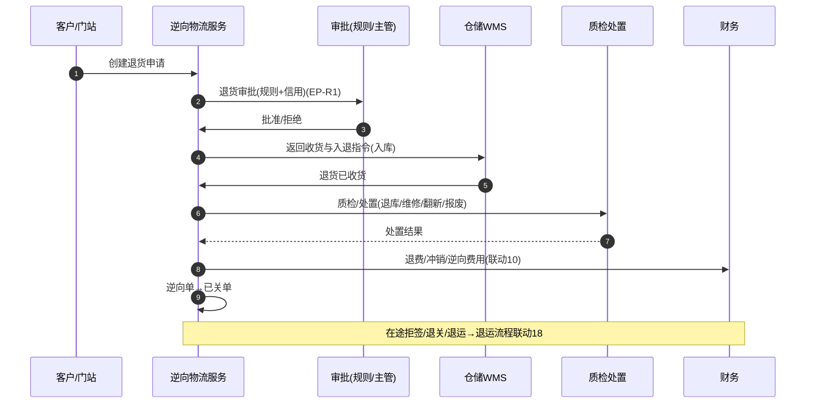

# 逆向物流（Reverse Logistics）深化设计 v4.0

> 针对 `19-物流七大功能覆盖对照` 中的缺口「逆向物流（退货审批/退件/维修重包/退款端到端）」补齐。
> 依据：`13-第二轮深化设计-总览` 模板；与 `09-仓储WMS`（退货入库）、`10-财务`（退费/冲销）、`11-CRM`（退换工单）、`18`（退运）衔接。

---

## 一、目标与范围再确认

逆向物流负责"物品从需求地回流到供应地/处置点"的全流程：**退货申请 → 审批 → 退回执行 → 收货验收 → 质检处置（退库/维修/翻新/报废/退款）→ 关单**，并承载逆向费用与在途退回（退关/拒签/退运）。

**边界**
- 属于逆向：退货/退件/换货回流、退运（在途退回）、退费与逆向费用、质检处置。
- 不属于：正常入库/出库作业（`09`）、干线订舱（`06`）、应收回款与坏账（`10`）——本模块产出逆向单据、处置事件与费用线索。

**范围**
- 电商退件、商户退货、在途拒签/退关/退运、仓储退库/报废。

---

## 二、端到端时序图

**退运（在途冻结退回）**：拒签/退关/海关扣退 → 触发退运指令，沿用 `18` 逆向主线反向推动。

---

## 三、状态机转换表

### 3.1 退货申请 `t_return_request`

| 始态 | 终态 | 触发 | 守卫 | 动作 | 事件 | 权限 |
| --- | --- | --- | --- | --- | --- | --- |
| 草稿 | 待审批 | 提交 | 原单/货物有效 | 路由审批 | `rv.requested` | 客户/客服 |
| 待审批 | 已批准 | 审批通过 | 退货规则+信用 | 下发返回指令 | `rv.approved` | 审批人 |
| 待审批 | 已拒绝 | 驳回 | 驳回原因 | 通知 | `rv.rejected` | 审批人 |
| 已批准 | 退回执行中 | 返回指令下达 | 支付退货运费/门站 | 关联逆向单 | `rv.executing` | 客服/调度 |
| 退回执行中 | 已收货 | 收货验收 | 数量/状态对照 | 入退库 | `rv.received` | 仓储 |
| 已收货 | 质检处理中 | 质检开始 | 无 | 质检任务 | `rv.inspecting` | 质检 |
| 质检处理中 | 处置完成 | 处置结论 | 处置规则 | 退库/维修/翻新/报废 | `rv.processed` | 质检/主管 |
| 处置完成 | 已退款 | 退费核销 | 退费规则 | 退款冲销(联动10) | `rv.refunded` | 财务 |
| 各终态 | 已关单 | 归档 | 处置/退费闭环 | 归档 | `rv.closed` | 客服/财务 |

### 3.2 逆向物流单 `t_return_order`（流向状态）

| 始态 | 终态 | 触发 | 守卫 | 动作 | 事件 |
| --- | --- | --- | --- | --- | --- |
| 待收货 | 已收货 | 入库/称重 | 原单对照 | 库存待检 | `rv.received` |
| 已收货 | 质检处理中 | 质检 | 无 | 质检任务 | `rv.inspecting` |
| 质检处理中 | 已退库 | 可售 | 无损 | 库存转正常 | `rv.restock` |
| 质检处理中 | 已维修/翻新 | 可修复 | 费用评估 | 维修任务 | `rv.repair` |
| 质检处理中 | 已报废 | 不可用 | 审批 | 报废+减值 | `rv.scrap` |
| 处置完成 | 已关单 | 费用/退款闭环 | 无 | 归档 | `rv.closed` |

---

## 四、字段联动与计算规则

| 场景 | 规则 |
| --- | --- |
| 退货审批 | 退货规则（时限/理由/信用）+ 授权等级 |
| 收货校验 | 原单对照件数/批次/效期 |
| 质检处置 | 处置规则映射（退库/维修/翻新/报废） |
| 逆向费用 | 退货运费/检验费/维修费（`EP-8` 记账） |
| 退费 | 退款金额 <= 收货价值，关联原收款冲销（`EP-9`） |
| 退运 | 拒签/退关触发退运指令，反向重置状态 |
| 库存联动 | 逾期退货、RMA 库存（待检/冻结/报废） |

---

## 五、领域事件进出清单

| 事件 | 方向 | 说明 |
| --- | --- | --- |
| `rv.requested/approved/rejected` | 发布 | 客服工单、通知、审批 |
| `rv.received/inspecting/processed` | 发布 | WMS 入库、库存变更、质检 |
| `rv.restock/repair/scrap` | 发布 | 库存、成本、减值 |
| `rv.refunded/closed` | 发布 | 财务冲销、关单向 |
| `exception.created` / `tracking.reject` | 订阅 | 拒签/退关→触发退运 |

---

## 六、可扩展点与参数化

| 扩展点 | 时机 | 可插入能力 | 作用域 |
| --- | --- | --- | --- |
| 退货审批（EP-R1） | 提交审批 | 退货时限/理由/信用规则 | 租户/客户/渠道 |
| 收货校验 | 收货 | 批次/效期/防伪校验 | 仓/渠道 |
| 质检处置 | 处置 | 处置映射、维修成本 | 租户/商品 |
| 退费策略 | 处置后 | 退款方式/比例/冲销 | 租户/客户 |
| 逆向渠道 | 退货入口 | 电商/商户/门店多渠道接入 | 渠道 |

### 参数化建议
| 参数 | 默认 | 说明 |
| --- | --- | --- |
| `rv.approve_timeframe` | 48h | 退货申请时限窗口 |
| `rv.restock_inspect_days` | 7 | 处置时限 |
| `rv.refund_auto_enabled` | 客户级 | 自动退费开关 |
| `rv.return_freight_rule` | 配置 | 逆向运费归属 |
| `rv.rma_hold` | true | 退库冻结待检 |

---

## 七、异常补充、指标口径、待 V5 深化项

### 异常补充
| 场景 | 处理 |
| --- | --- |
| 退货超时未寄回 | 超期取消+释放原单 |
| 退件破损/少量 | 质检差异→协商/赔付 |
| 退关税费 | 退运流程+税费冲销 |
| 退款争议 | 转入工单+客服复核 |

### 指标口径
| 指标 | 口径 |
| --- | --- |
| 退货率 | 退货单/销售单 |
| 逆向履约时效 | 申请→处置完成 |
| 再上市率 | 退库/报废+维修占比 |
| 退库收益/逆向成本 | 商品损失 vs 逆向费用 |
| 退运率 | 拒签/退关占比 |

### 待 V5 深化项
- 电商平台退换货多通道（OLO/reverse）对接。
- 以旧换新/回收（翻新再制造）价值管理与抵扣。
- 逆向物流碳排放与绿色物流测算。
