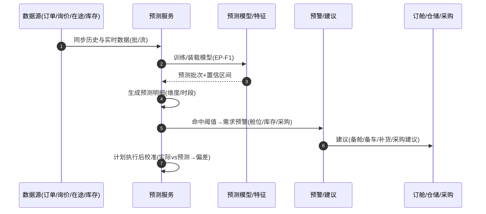

# 需求预测（Demand Forecasting / Planning）深化设计 v4.0

> 针对 `19-物流七大功能覆盖对照` 中扩展功能缺口「需求预测（货量/库存/采购需求）」补齐。
> 依据：`13-第二轮深化设计-总览` 模板；与 `04-询价报价`、`03-委托单`、`09-仓储WMS`、`06-订舱`、`10-财务` 衔接。

---

## 一、目标与范围再确认

需求预测为"决策支撑"：基于历史订单/询价/在途数据，预测**货量、舱位/运力、库存、采购需求**，输出置信区间并触发备舱、备车、采购与库存预警，反哺运营与销售。

**边界**
- 属于需求预测：预测批次、维度建模、预测明细与校准、预警触发。
- 不属于：实际计费/结算（`10`）、实际舱位/运力分配（`06`）、实际采购入库（`23-采购供应`）——本模块只产出预测与建议。

**维度**
- 货量预测（航线/客户/业务线/时间段）
- 运力/舱位需求预测（联动订舱配额）
- 库存预测（销量→安全库存/补货点）（联动 `09`）
- 采购需求预测（联动 `23`）

---

## 二、端到端时序图

**闭环**：预测 → 建议执行 → 实际回流 → 重校（`forecast.recalibrated`），滚动优化。

---

## 三、状态机转换表

### 3.1 预测任务 `t_forecast_run`

| 始态 | 终态 | 触发 | 守卫 | 动作 | 事件 | 权限 |
| --- | --- | --- | --- | --- | --- | --- |
| 待运行 | 运行中 | 启动(批/手动) | 数据就绪 | 调模型 | `forecast.started` | 调度/分析 |
| 运行中 | 已完成 | 预测产出 | 指标校验 | 落明细+预警 | `forecast.completed` | 系统 |
| 运行中 | 已失败 | 异常 | 重试规则 | 重跑/告警 | `forecast.failed` | 系统/运维 |
| 已完成 | 已校准 | 实际回填比对 | 有实际值 | 算偏差、调参 | `forecast.recalibrated` | 分析 |

### 3.2 预测明细 `t_forecast_item`

| 始态 | 终态 | 触发 | 守卫 | 动作 |
| --- | --- | --- | --- | --- |
| 生成 | 已校准 | 实际值回填 | 同维度同时间 | 计算偏差/命中 |
| 生成 | 预警 | 偏差/值超阈值 | 阈值规则 | 输出需求预警 |
| 生成 | 已落库 | 建议采纳 | 审批 | 转建议执行 |

---

## 四、字段联动与计算规则

| 场景 | 规则 |
| --- | --- |
| 数据特征 | 订单/询价/季节/节假日/活动/汇率 |
| 预测维度 | 航线×客户×业务线×时间粒度（日/周/月） |
| 模型 | 时间序列/回归/分组分位；置信区间 |
| 偏差校准 | 实际 vs 预测，滚动误差分析 |
| 阈值预警 | 舱位/库存/采购需求超阈值→建议 |
| 输出衔接 | 备舱需求→订舱配额；补货点→库存；采购→`23` |

---

## 五、领域事件进出清单

| 事件 | 方向 | 说明 |
| --- | --- | --- |
| `forecast.started/completed/failed` | 发布 | 分析、调度、运维 |
| `forecast.recalibrated` | 发布 | 模型迭代 |
| `demand.alert` | 发布 | 备舱/备车/补货/采购建议 |
| `order.closed` / `inquiry.closed` | 订阅 | 历史数据回流 |
| `forecast.item.adopted` | 发布 | 衔接订舱/仓储/采购 |

---

## 六、可扩展点与参数化

| 扩展点 | 时机 | 可插入能力 | 作用域 |
| --- | --- | --- | --- |
| 数据源接入（EP-F1） | 同步数据 | 新增数据源/口径 | 租户 |
| 模型选择 | 运行 | 算法/参数/分组 | 租户/维度 |
| 特征扩展 | 建模 | 季节性/活动/外部特征 | 租户 |
| 阈值预警 | 产出 | 预警阈值/渠道 | 租户/客户 |
| 建议执行 | 预警 | 备舱/补货/采购动作 | 租户 |

### 参数化建议
| 参数 | 默认 | 说明 |
| --- | --- | --- |
| `fc.run_period` | 日/周/月 | 预测周期 |
| `fc.confidence` | 0.9 | 置信系数 |
| `fc.alert_threshold` | 配置 | 需求预警阈值 |
| `fc.calibrate_enabled` | true | 滚动校准开关 |
| `fc.horizon_days` | 30/90 | 预测前瞻 |

---

## 七、异常补充、指标口径、待 V5 深化项

### 异常补充
| 场景 | 处理 |
| --- | --- |
| 数据稀疏/缺失 | 平滑+置信下调 |
| 模型失败 | 重跑+回退上一版本 |
| 预测偏差超限 | 校准+人工复议 |
| 活动/不可抗力扰动 | 外部特征修正 |

### 指标口径
| 指标 | 口径 |
| --- | --- |
| 预测准确率(MAPE) | 偏差率均值 |
| 命中率 | 限制内命中占比 |
| 预警采纳率 | 采纳建议/建议数 |
| 校准时效 | 实际回填→校准 |

### 待 V5 深化项
- 机器学习预测管道与特征库接入。
- 舱位/运力供需匹配与定价联动（衔接报价）。
- 供应链级需求计划（S&OP）与产销协同。
