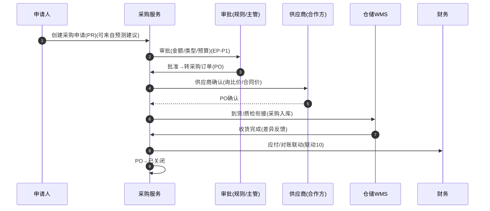

# 采购供应（Procurement Supply）深化设计 v4.0

> 针对 `19-物流七大功能覆盖对照` 中扩展功能缺口「采购供应（采购订单/合同/供应商协同）」补齐。
> 依据：`13-第二轮深化设计-总览` 模板；与 `02 基础资料(合作方)`、`09-仓储WMS(采购入库)`、`10-财务(应付)`、`22-需求预测` 衔接。

---

## 一、目标与范围再确认

采购供应负责"资源/货品的外部获取"：**采购申请(PR) → 审批 → 采购订单(PO) → 供应商确认 → 到货质检 → 入库 → 应付联动**，并维护采购合同与供应商协同。

**边界**
- 属于采购供应：采购申请/审批、采购订单与合同、到货与质检衔接、供应商对账联动。
- 不属于：入库作业本身（`09-仓储WMS`）、付款结算（`10-财务`）、需求预测（`22`）——本模块产出采购单与收货线索。

**范围**
- 自营运力资源采购（燃油/配件）、仓库损耗补给、增值服务物料（包装/耗材）、代理服务采购；对接 `22` 采购需求建议。

---

## 二、端到端时序图

**供应商协同**：询比价 → 合同 → 订单 → 对账，多轮台账驱动采购执行与 `10` 应付。

---

## 三、状态机转换表

### 3.1 采购申请（PR）`t_purchase_request`

| 始态 | 终态 | 触发 | 守卫 | 动作 | 事件 | 权限 |
| --- | --- | --- | --- | --- | --- | --- |
| 草稿 | 待审批 | 提交 | 需求/预算校验 | 路由审批 | `pu.requested` | 申请人 |
| 待审批 | 已批准 | 审批通过 | 金额/预算门禁 | 转采购订单 | `pu.approved` | 审批人 |
| 待审批 | 已拒绝 | 驳回 | 驳回原因 | 通知 | `pu.rejected` | 审批人 |
| 已批准 | 已转PO | 生成采购订单 | 供应商有效 | 生成PO | `po.created` | 采购 |

### 3.2 采购订单（PO）`t_purchase_order`

| 始态 | 终态 | 触发 | 守卫 | 动作 | 事件 | 权限 |
| --- | --- | --- | --- | --- | --- | --- |
| 草稿 | 待确认 | 提交供应商 | 询比价/合同价 | 发送供应商 | `po.submitted` | 采购 |
| 待确认 | 已确认 | 供应商确认 | 交付期核验 | 可收货 | `po.confirmed` | 系统/采购 |
| 待确认 | 已取消 | 供应商拒单/变更 | 变更审批 | 重选供应商 | `po.cancelled` | 采购/主管 |
| 已确认 | 部分到货 | 分批到货 | 无 | 入退差异 | `po.partial` | 仓储/采购 |
| 已确认/部分到货 | 已到货 | 全部到货 | 收货质检通过 | 应付联动 | `po.received` | 仓储/采购 |
| 已到货 | 已关闭 | 对账/结案 | 差异处理完毕 | 归档 | `po.closed` | 采购/财务 |

---

## 四、字段联动与计算规则

| 场景 | 规则 |
| --- | --- |
| 采购审批 | 金额/类型/预算分级路由 |
| 询比价 | 多家供应商报价+交期比较 |
| 合同价 | 引用采购合同台账（`t_purchase_contract`） |
| 到货质检 | 数量/质量对照→差异（联动 `09` 质检/退换） |
| 应付联动 | PO 收货后生成应付线索（联动 `10/EP-8`） |
| 预测衔接 | `22` 采购需求建议 → 直接生成 PR |

---

## 五、领域事件进出清单

| 事件 | 方向 | 说明 |
| --- | --- | --- |
| `pu.requested/approved/rejected` | 发布 | 审批、通知、预算 |
| `po.submitted/confirmed/received/closed` | 发布 | 财务应付、WMS入库、对账 |
| `pu.demandSuggested` | 订阅 | 需求预测建议 → 建PR |
| `ap.invoiced` | 订阅 | 应付联动闭环 |

---

## 六、可扩展点与参数化

| 扩展点 | 时机 | 可插入能力 | 作用域 |
| --- | --- | --- | --- |
| 采购审批（EP-P1） | 提交 | 金额/预算/类型路由 | 租户/组织 |
| 询比价 | 下PO | 报价解析、对比算法 | 品类/供应商 |
| 供应商评估 | 确认 | 绩效/交付/资质校验 | 供应商 |
| 到货质检 | 收货 | 质检规则、差异处理 | 仓/品类 |
| 应付关联 | 收货后 | 付款条件、对账（联动10） | 租户/供应商 |

### 参数化建议
| 参数 | 默认 | 说明 |
| --- | --- | --- |
| `pu.approve_by_amount` | 分级 | 金额门禁 |
| `pu.quotation_required` | 品类级 | 询比价开关 |
| `pu.receive_quality_check` | 品类级 | 到货质检开关 |
| `po.payment_terms` | 供应商 | 应付付款条件 |

---

## 七、异常补充、指标口径、待 V5 深化项

### 异常补充
| 场景 | 处理 |
| --- | --- |
| 供应商拒单/交期延误 | 改期/更换+成本影响评估 |
| 到货短缺/劣质 | 质检差异→退换/扣款 |
| 询比价缺失 | 沿用合同价/历史价+标记 |
| 预算超支 | 审批拦截+预算调整 |

### 指标口径
| 指标 | 口径 |
| --- | --- |
| 采购周期 | PR→PO→收货 |
| 交期达成率 | 按时到货/订单 |
| 到货合格率 | 合格/到货 |
| 采购成本节省 | 比价降价率 |
| 供应商绩效 | 交期/质量/价格 |

### 待 V5 深化项
- 供应商门户协同（报价/对账/送货预约）。
- 电子签合同与合同台账版本化。
- 与预测/库存联动的高级补货计划（MRP/ROP）。
