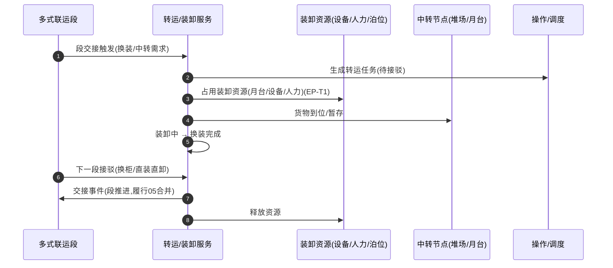

# 装卸 / 换装转运（Handling & Transshipment）深化设计 v4.0

> 针对 `19-物流七大功能覆盖对照` 中最后缺口「装卸搬运/干线中转/换柜/直装直卸/转运节点」补齐。
> 依据：`13-第二轮深化设计-总览` 模板；衔接 `06-订舱操作`（干线段）、`09-仓储WMS`（库内/暂存）、`20-配送调度`（末端接驳）、`05-多式联运段`。

---

## 一、目标与范围再确认

装卸搬运与换装转运是衔接不同运输/仓储环节的"转运层"（七大功能之三）。本模块把"接驳 → 装卸 → 换装/中转 → 离场"固化为一等业务，管理**转运任务、装卸作业、装卸资源（设备/人力/泊位/月台/堆场）、中转节点**，支撑多式联运段交接与中转暂存。

**边界**
- 属于装卸/转运：段间接驳、换柜/直装直卸、中转暂存、装卸资源占用、交接节点记录。
- 不属于：干线运输（`06`）、库内上架/拣货（`09`）、末端配送（`20`）——本模块产出**交接事件与资源占用**，驱动段状态推进（`05` 多式联运合并）。

**范围**
- 海铁/海空/空铁换装、铁路换轨、跨境换柜、项目物流大件装卸、中转区暂存。

---

## 二、端到端时序图

**直装直卸 vs 中转暂存**：按策略（时间/场地/装载率）判定直装或入中转区，减少二次搬运。

---

## 三、状态机转换表

### 3.1 转运任务 `t_transshipment_task`

| 始态 | 终态 | 触发 | 守卫 | 动作 | 事件 | 权限 |
| --- | --- | --- | --- | --- | --- | --- |
| 待接驳 | 已到位 | 货物到位 | 资源可用 | 占月台 | `ts.arrived` | 调度/仓储 |
| 已到位 | 装卸中 | 启动装卸 | 资源就绪 | 作业开始 | `ts.loading` | 操作/调度 |
| 装卸中 | 已换装 | 换装完成 | 交接核验 | 触发段交接 | `ts.transferred` | 操作 |
| 已换装 | 已离场 | 下一段接驳离场 | 无 | 释放资源 | `ts.departed` | 调度/操作 |
| 各运行态 | 异常 | 破损/延误/缺资源 | 等级判定 | 转异常/工单 | `exception.created` | 系统 |

### 3.2 装卸作业 `t_handling_order`

| 始态 | 终态 | 触发 | 守卫 | 动作 | 事件 | 权限 |
| --- | --- | --- | --- | --- | --- | --- |
| 待安排 | 装卸中 | 派工 | 资源/人力可用 | 占位 | `hd.started` | 调度 |
| 装卸中 | 已完成 | 作业完成 | 数量核验 | 释放资源 | `hd.completed` | 操作 |
| 装卸中 | 异常 | 破损/加班 | 上报 | 转处理 | `hd.exc` | 操作/系统 |

---

## 四、字段联动与计算规则

| 场景 | 规则 |
| --- | --- |
| 换柜/直装 | 按策略（装载率/时效/场地）判定直装或中转暂存 |
| 资源占用 | 设备/人力/月台/堆场的可用与占用、防冲突 |
| 段交接 | 换装完成 → 写交接节点 → 驱动 `05` 段合并 |
| 装卸效率 | 用时/吨位计量 |
| 中转暂存 | 入库暂存区（联动 `09` 中转库位），出仓再装 |

---

## 五、领域事件进出清单

| 事件 | 方向 | 说明 |
| --- | --- | --- |
| `ts.arrived/loading/transferred/departed` | 发布 | 跟踪、多式联运段交接、调度 |
| `hd.started/completed` | 发布 | 作业台账、资源视图 |
| `resource.occupied/released` | 发布 | 资源/月台占用预测 |
| `segment.handover` | 订阅/发布 | 驱动 `05` 段状态合并 |
| `exception.created` | 发布 | 客服/异常联动 |

---

## 六、可扩展点与参数化

| 扩展点 | 时机 | 可插入能力 | 作用域 |
| --- | --- | --- | --- |
| 装卸资源调度（EP-T1） | 转运 | 设备/人力/委托第三方装卸 | 租户/节点 |
| 直装/暂存策略 | 到位 | 判定规则（装载率/时效） | 租户/航线 |
| 换柜策略 | 换装 | 换柜/直装决策 | 租户/承运人 |
| 中转暂存 | 装卸后 | 入库/免单暂存（联动09） | 仓/节点 |
| 交接校验 | 段交接 | 数量/单证校验 | 租户 |

### 参数化建议
| 参数 | 默认 | 说明 |
| --- | --- | --- |
| `ts.direct_load_ratio` | 配置 | 直装判定阈值 |
| `ts.max_storage_hours` | 24h | 中转暂存时限 |
| `ts.resource_advance_hr` | 2h | 资源预占提前量 |
| `ts.third_party_handling` | false | 第三方装卸接入 |

---

## 七、异常补充、指标口径、待 V5 深化项

### 异常补充
| 场景 | 处理 |
| --- | --- |
| 装卸资源冲突/不足 | 资源池重排+第三方补位 |
| 换装破损 | 交接差异→异常→理赔 |
| 中转超期 | 仓储费预警+催装 |
| 段衔接延误 | 段交接异常→跨段回溯（`05`/`07`） |

### 指标口径
| 指标 | 口径 |
| --- | --- |
| 转运/换装时效 | 到位→离场 |
| 直装率 | 直装/转运任务 |
| 装卸资源利用率 | 占用/可用 |
| 中转破损率 | 破损/中转量 |
| 段交接准时率 | 按时交接占比 |

### 待 V5 深化项
- 全程装卸与转运时间预测（联动 `22`）。
- 装卸资源最优调度（设备/人力/泊位）算法。
- 与港口/铁路堆场系统（TOS）对接换取装卸回执。
