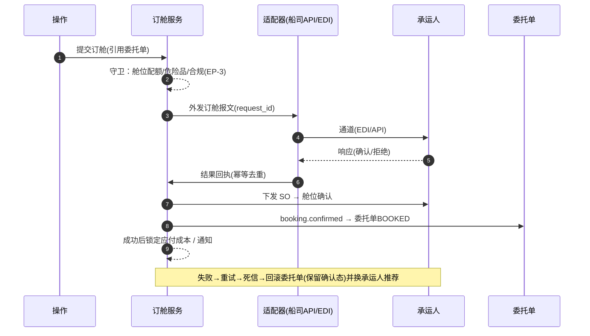

# 订舱与操作（Booking / Ops）深化设计 v4.0

> 依据：`13-第二轮深化设计-总览` 第二节模板；基线：`06-订舱操作业务细化-v3.0`、`02/五`.
> 本轮重点：**订舱/提单/补料/集装箱四组状态机转换表、订舱渠道时序、截关/截港时限管理、EP-3/EP-4、Saga 回滚**。

---

## 一、目标与范围再确认

订舱与操作是"承诺舱位并落地作业"的承重环节。v4 强化四件事：

1. 订舱、提单（BL）、补料（SI）、集装箱（Container）四套**全量状态转换表**，互相锚定、可配置。
2. **订舱渠道（EDI/API/邮件/平台）时序**与外发幂等/重试，保证与承运人交互可靠。
3. **截关/截港/SO 时限管理**与超时自动化（锁定/预警），守住装船窗口。
4. 登记 **EP-3/EP-4** 与参数化，覆盖危险品、冷链、超大件等特殊货物不炸主流程。

---

## 二、订舱主时序（多渠道）

### 2.1 自动/EDI 订舱时序



### 2.2 手工订舱时序（邮件/电话）

```
下订舱(状态申请中) → 通过邮件/电话与承运人确认
   → 收到 SO 手工录入 → 确认舱位 → booking.confirmed
   → 未得到确认且临近截关 → 升级/换承运人
```

> 通道统一经适配器收口，核心状态机不感知具体承运人差异（`13/2.5`）。

---

## 三、状态机转换表（四套）

### 3.1 订舱（Booking）— 沿用 v3 十态

| 始态 | 终态 | 触发 | 守卫 | 动作 | 事件 | 权限 |
| --- | --- | --- | --- | --- | --- | --- |
| 待订 | 申请中 | 发起订舱 | 配额+特殊货物校验 | 外发通道 | `booking.submitted` | 操作 |
| 申请中 | 已订 | 承运人接单 | 无 | 补充信息 | `booking.acknowledged` | 系统/操作 |
| 已订 | 已确认 | 舱位确认 | SO 校验通过 | 扣舱位、锁成本 | `booking.confirmed` | 系统 |
| 已确认 | 已放舱 | 承运人放舱位 | 无 | 通知操作 | `booking.allocated` | 系统 |
| 已放舱 | 已截关 | 过截关时间 | 报关/单证/VGM 齐 | 锁定操作窗口 | `booking.cutoff_passed` | 系统 |
| 已放舱/已截关 | 已装船 | 装船事件 | 集装箱齐+放行 | 委拖舟 SHIPPED 联动 | `milestone.reached` | 系统 |
| 申请中/已订/已确认 | 已退舱 | 退舱 | 规则 | 释放舱位 | `booking.returned` | 操作/系统 |
| 各有效态 | 已变更 | 订舱变更 | 变更审批 | 重新确认 | `booking.amended` | 操作 |
| 各进行态 | 已取消 | 取消 | 撤单规则 | 释放舱位+回滚 | `booking.cancelled` | 主管 |
| 已装船 | 已完成/在途 | 航程推进 | 无 | 交跟踪 | `booking.shipped` | 系统 |

### 3.2 提单（BL）— 七态

| 始态 | 终态 | 触发 | 守卫 | 动作 | 事件 | 权限 |
| --- | --- | --- | --- | --- | --- | --- |
| 草稿 | 待客户确认 | 编制完成(补料齐) | 单证校验 | 发送客户复核 | `bl.pending_confirm` | 操作 |
| 待客户确认 | 已确认 | 客户确认 | 无异议 | 提交承运人 | `bl.confirmed` | 客户/操作 |
| 待客户确认 | 草稿 | 客户驳回 | 修改原因 | 返回修订 | `bl.returned` | 客户 |
| 已确认 | 已修改 | 提单修改 | 修改审批+费用评估 | 重新确认 | `bl.amended` | 操作/主管 |
| 已确认 | 已签发 | 承运人签发 | 无 | 放单前校验 | `bl.issued` | 系统 |
| 已签发 | 已放单 | 放单 | 到付结清/授权 | 交付正本/电放/SEA | `bl.released` | 财务/操作 |
| 已签发 | 已电放 | 电放指令 | 客户授权+费用清 | 发送电放 | `bl.telex_release` | 操作/主管 |
| 各有效态 | 已作废 | 作废 | 审批 | 归档+通知 | `bl.voided` | 主管 |

> 放单门禁：正本/电放/海运单（SWB）三选一，均需**财务结清或授权**（`06/5.5`）。

### 3.3 补料（SI）— 四态 + VGM/监管

| 始态 | 终态 | 触发 | 守卫 | 动作 | 事件 | 权限 |
| --- | --- | --- | --- | --- | --- | --- |
| 草稿 | 已提交 | 提交补料 | 必填+判重 | 交承运人校验 | `si.submitted` | 操作 |
| 已提交 | 已确认 | 承运人/客户确认 | VGM/监管齐 | 供提单签发 | `si.confirmed` | 系统 |
| 已提交 | 已驳回 | 驳回 | 退回原因 | 通知修正 | `si.rejected` | 系统/操作 |
| 已确认 | 完成 | 提单确认后 | 无 | 归档 | `si.completed` | 系统 |

> VGM/AMS/ENS/AFR/ISR 申报作为 SI 附加条件在"已提交→已确认"守卫中强校验，按国家映射截点（`06/6.5`）。

### 3.4 集装箱动态（Container）— 十节点

| 始态 | 终态 | 触发 | 守卫 | 动作 | 事件 | 权限 |
| --- | --- | --- | --- | --- | --- | --- |
| 预提柜 | 已提柜 | 提取空柜 | 拖车任务 | — | `container.picked` | 操作/仓库 |
| 已提柜 | 已装柜 | 装箱完成 | 装柜照片合规 | 生成跟踪起点 | `container.stuffed` | 操作 |
| 已装柜 | 已进港 | 进港 | 报关放行校验 | — | `container.gated_in` | 系统 |
| 已进港 | 已装船 | 装船 | 放行+截关通过 | 委托单SHIPPED | `milestone.reached` | 系统 |
| 已装船 | 在途 | 开船 | 无 | 推进跟踪 | `container.departed` | 系统 |
| 在途 | 已卸船 | 卸船 | 无 | 到港里程碑 | `container.arrived` | 系统 |
| 已卸船 | 已提货 | 提货出港 | 清关放行 | — | `container.delivered_out` | 系统/操作 |
| 已提货 | 已派送 | 派送 | 无 | 送货 | `milestone.reached` | 操作 |
| 已派送 | 已签收 | 签收 | 无 | 委拖单DELIVERED | `milestone.reached` | 系统 |
| 进行态 | 退关/查验 | 异常 | 海关/规则 | 异常联动 | `exception.created` | 系统 |

---

## 四、截关/截港时限管理（防超窗）

| 截止类型 | 提前量 | 预警节奏 | 超时动作 |
| --- | --- | --- | --- |
| 截货 / 进港 | ETD-1~3d | 4h→1h 预警 | 标记风险单，升级 |
| 截关 | ETD-1~2d | 放行倒计时 | 未放行→预警航运/海关 |
| 截单（补料） | ETD-1~2d | 按 SI 截止 | 未提交→催办+锁定 |
| VGM | ETD-1d | 24h 提醒 | 缺 VGM→拦截图 |
| 危险品 | ETD-3~5d | 前置提醒 | 未申报→禁订 |

> 超时数据统一进 `booking.cutoff_passed` 事件，供 SLA 看板与改期决策（更承运人/船期）。

---

## 五、领域事件进出清单

| 事件 | 方向 | 说明 |
| --- | --- | --- |
| `booking.submitted/confirmed/allocated/cancelled` | 发布 | 委托单、财务、跟踪订阅 |
| `bl.issued/released/telex_release/voided` | 发布 | 跟踪、客服、单证归档 |
| `si.submitted/confirmed/rejected` | 发布 | 提单、通知、VGM 合规 |
| `container.*` / `milestone.reached` | 发布 | 跟踪、委托单进度聚合 |
| `booking.cutoff_passed` | 发布 | SLA 看板、改期决策 |
| `booking.confirmed` | 订阅方 | 订舱确认→财务锁应付、成本重估 |

---

## 六、可扩展点与参数化（EP-3 / EP-4 聚焦）

| 扩展点 | 时机 | 可插入能力 | 作用域 |
| --- | --- | --- | --- |
| 订舱前校验（EP-3） | 提交订舱 | 危险品/冷链/超大件强校验、合规映射 | 承运人×货物类型 |
| 单证生成（EP-4） | BI/SI/装箱单 | 客户/航线定制模板、盖章、格式 | 客户/航线 |
| 渠道路由 | 外发前 | EDI/API/邮件/平台优先级策略 | 租户/承运人 |
| 监护人批 | 放单前 | 到付结清/电放授权规则 | 客户×单证 |
| 协议映射 | 订舱确认 | 与承运人的协议舱位/费用映射 | 承运人/合同 |
| 特殊货物作业 | 操作执行 | 危险品隔离/冷链温控/超大件勘验流程 | 货物类型 |

### 6.1 参数化建议

| 参数 | 默认 | 说明 |
| --- | --- | --- |
| `booking.channel_priority` | EDI>API>邮件 | 自动订舱路由 |
| `booking.cutoff_warn_hours` | 4/1 | 截关预警两档 |
| `booking.dgr_lead_days` | 3~5 | 危险品提前期 |
| `bl.original_copies` | 3 | 正本默认份数 |
| `bl.release_require_clear` | true | 放单需结清/授权 |
| `container.photo_min` | 6 | 装箱必拍张数 |

---

## 七、异常补充、指标口径、待 V5 深化项

### 7.1 异常补充

| 场景 | 处理 |
| --- | --- |
| 订舱失败/超时 | 重试→死信→回滚委拖单→推荐替代承运人 |
| 截关前未订上 | 改船期/换承运人，SLA 联动升级 |
| 补料/VGM 缺失 | 截单闭环锁定+催办 |
| 危险品申报延误 | 禁订拦截，提前期预警告警 |
| 提单修改 | 费用评估+审批，改单费入账 |
| 放单未结清 | 财务门禁拦截 |

### 7.2 指标口径

| 指标 | 口径 |
| --- | --- |
| 订舱成功率 | 确认数 / 订舱数 |
| 订舱时效 | 提交→确认 时长 |
| 截关准点率 | 按时截关放行占比 |
| 提单放单时效 | 签发→放单 时长 |
| 补料一次通过率 | 一次确认 / 提交数 |
| 改单率/改单费率 | 修改提单占比及费用 |

### 7.3 待 V5 深化项

- 多式联运段式舱位与班列/铁路订舱的专项时序与交接。
- 与承运人协议舱位池、放舱配额预测。
- 特殊货物（危险品/冷链/超大件）全流程专项规则引擎细化。
