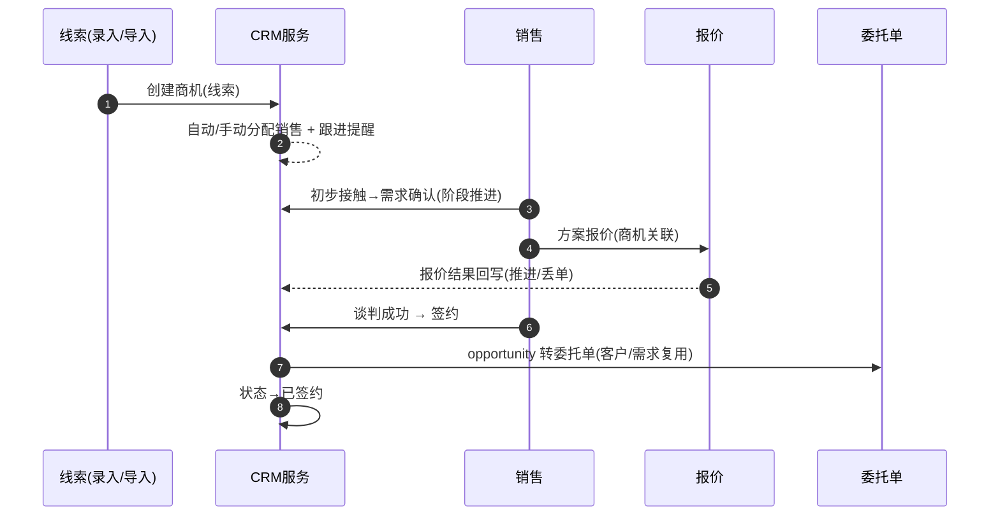

# CRM 与客服（CS）深化设计 v4.0

> 依据：`13-第二轮深化设计-总览` 第二节模板；基线：`11-CRM客服业务细化-v3.0`、`02/十`.
> 本轮重点：**商机/工单状态转换表、销售漏斗、SLA 升级、分派与回访、满意度闭环、自动回复机器人、EP-11**。

---

## 一、目标与范围再确认

CRM+客服管"从获客到留存"的人和工单。v4 强化四件事：

1. **商机漏斗 + 状态机**（线索→…→签约/丢单）与转化、转委托路径。
2. **工单全量状态转换表**（含转交/升级/重开）与**按业务类型分派 + SLA 升级**。
3. **等级→回访→满意度闭环**与客户分级/流失预警联动。
4. 登记 **EP-11**（升级/分派/动作建议）与自动回复机器人场景。

---

## 二、端到端时序图

### 2.1 商机→委托 主时序



### 2.2 工单→处置主时序

```
工单创建(客户/异常/自动加分派) → 按业务类型/队列入分派 → 受理(SLA时钟)
   → 处理(回复/内部备注/协同) → 解决 → 客户确认 → 关闭 → 满意度评价
   （超时→升级；重大投诉→经理介入）
```

---

## 三、状态机转换表

### 3.1 商机（Opportunity）

| 始态 | 终态 | 触发 | 守卫 | 动作 | 事件 | 权限 |
| --- | --- | --- | --- | --- | --- | --- |
| 线索 | 初步接触 | 首联 | 分配有效 | 跟进登记 | `opp.touched` | 销售 |
| 初步接触 | 需求确认 | 需求明确 | 无 | 记录需求 | `opp.needs` | 销售 |
| 需求确认 | 方案报价 | 发报价 | 报价创建 | 关联报价 | `opp.quoted` | 销售 |
| 方案报价 | 谈判 | 进入议价 | 报价有效 | — | `opp.negotiating` | 销售 |
| 谈判 | 签约 | 达成一致 | 授信/协议 | 转委托单 | `opp.won` | 销售 |
| 各阶段 | 丢单/停滞/暂停/搁置 | 失联、放弃 | 原因记录 | 对接后续 | `opp.lost`/`opp.stalled` | 销售/主管 |
| 签约/丢单 | 已关闭 | 归档 | 无 | 归档/复盘 | `opp.closed` | 销售 |

### 3.2 工单（Ticket）

| 始态 | 终态 | 触发 | 守卫 | 动作 | 事件 | 权限 |
| --- | --- | --- | --- | --- | --- | --- |
| 待处理 | 处理中 | 受理 | 分派有效 | SLA 时钟 | `ticket.assigned` | 客服/系统 |
| 待处理 | 已转交 | 转交部门 | 归属部门 | 重新分派 | `ticket.forwarded` | 客服/主管 |
| 处理中 | 升级 | 超时/升级条件 | SLA 规则 | 级联升级 | `ticket.escalated` | 客服/主管 |
| 处理中/升级 | 已解决 | 处置完成 | 客户确认(可选) | 触发评价 | `ticket.resolved` | 客服/操作 |
| 已解决 | 已关闭 | 确认/点评 | 无 | 满意度统计 | `ticket.closed` | 客服 |
| 已关闭 | 重开 | 客户异议 | 审批 | 重置时钟 | `ticket.reopened` | 主管 |
| 待处理 | 已取消/作废 | 无效、误单 | 审批 | 归档 | `ticket.voided` | 客服/主管 |

### 3.3 工单分派映射（依业务类型）

| 业务类型 | 处理部门 |
| --- | --- |
| 询价/商机 | 销售 |
| 订单/订舱 | 操作 |
| 报关/查验 | 关务 |
| 仓储/库存 | 仓储 |
| 结算/开票 | 财务 |
| 投诉/异常 | 客服/多部门 |

---

## 四、字段联动与计算规则

| 场景 | 规则 |
| --- | --- |
| 分派 | 业务类型→部门/技能组→负载均衡 |
| SLA 时钟 | 按优先级设定首次响应/解决时限 |
| 升级 | 超时→处理人→主管→运营经理 |
| 评价触发 | 工单关闭时（满意度 1~5） |
| 客户分级/流失预警 | 货量/周期活跃度/异常频次计算 |
| 挽回 | 流失预警→专属跟进/优惠建议 |

---

## 五、领域事件进出清单

| 事件 | 方向 | 说明 |
| --- | --- | --- |
| `opp.*` | 发布 | CRM、销售报表、机会 |
| `ticket.assigned/escalated/resolved/closed` | 发布 | SLA、通知、满意度 |
| `ticket.created` | 订阅 | 异常/跟踪联动（07） |
| `satisfaction.submitted` | 发布 | 满意度统计 |
| `quotation.accepted/rejected` | 订阅 | 商机阶段推进 |
| `exception.*` | 订阅 | 异常转工单 |

---

## 六、可扩展点与参数化（EP-11 聚焦）

| 扩展点 | 时机 | 可插入能力 | 作用域 |
| --- | --- | --- | --- |
| 升级/分派（EP-11） | 工单/异常 | 自定义分派、升级阶梯 | 租户/部门 |
| 自动回复机器人 | 待处理/常见问答 | 场景+意图→回复建议 | 租户/客户 |
| 回访问卷 | 评价/回访 | 模板、渠道 | 租户 |
| 流失预警 | 周期 | 阈值/挽留动作 | 租户/客户 |
| 知识库 | 任意 | FAQ 分类、建议检索 | 租户 |

### 6.1 参数化建议

| 参数 | 默认 | 说明 |
| --- | --- | --- |
| `crm.sla_hi_first` | 15min | 高优先级首响 |
| `crm.sla_hi_resolve` | 4h | 高优先级解决 |
| `crm.escalate_threshold` | 超时 30min | 升级触发 |
| `crm.satisfaction_enum` | 1~5 | 评价等级 |
| `crm.churn_threshold` | 配置 | 流失判定阈值 |
| `crm.bot_scene` | 常见问答 | 机器人启用场景 |

---

## 七、异常补充、指标口径、待 V5 深化项

### 7.1 异常补充

| 场景 | 处理 |
| --- | --- |
| 无合适坐席 | 路由到技能组/主管转派 |
| SLA 超时 | 分级升级+记录 |
| 客户重复反馈 | 关联既有工单去重 |
| 重大投诉 | 快速升级+高层介入 |
| 流失预警误报 | 阈值校准+人工复核 |

### 7.2 指标口径

| 指标 | 口径 |
| --- | --- |
| 商机转化率 | 签约/商机 |
| 销售漏斗各阶段 | 阶段数量/停留时长 |
| 工单首响/解决时效 | 分优先级 |
| 一次解决率 | 未重开占比 |
| CSAT | 满意度均值 |
| 流失率/挽回率 | 预警客户维度 |

### 7.3 待 V5 深化项

- 智能工单自动分类与建议回复（接入 NLP/知识库）。
- 客户 360 视图（跨订单/财务/工单/跟进）统一口径。
- 销售绩效（商机+回款+毛利）与提成的联动模型。
