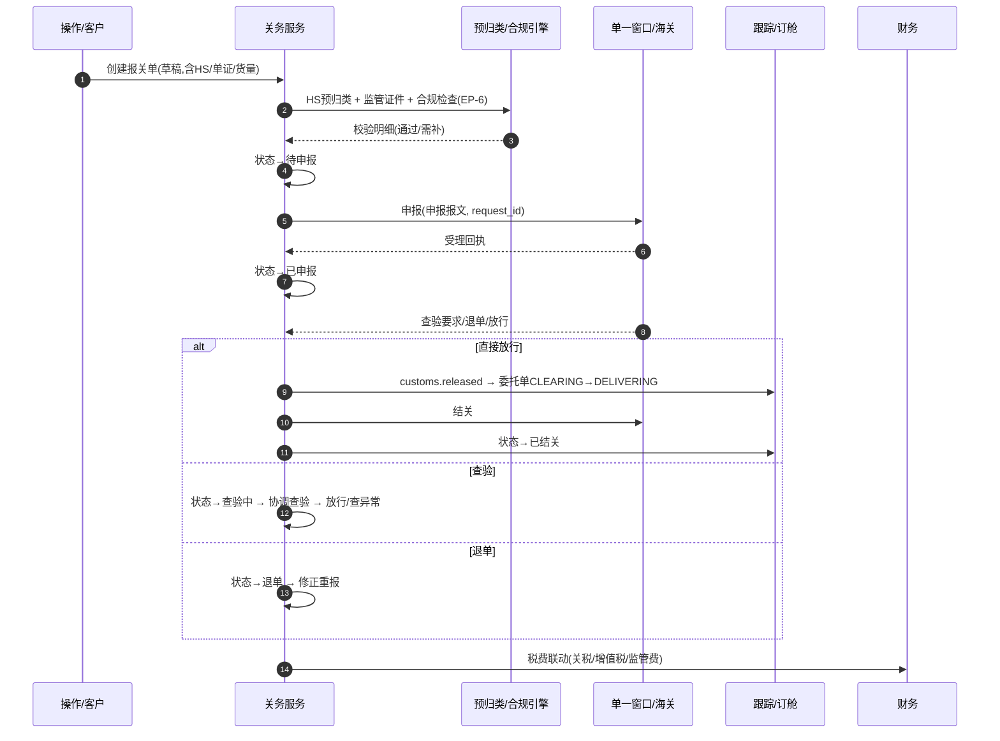

# 报关与关务（Customs）深化设计 v4.0

> 依据：`13-第二轮深化设计-总览` 第二节模板；基线：`08-报关关务业务细化-v3.0`、`02/七`.
> 本轮重点：**报关单全量状态转换表、单一窗口对接时序、预归类/监管证件强校验、查验/缴税出口与进口双链路、EP-6**。

---

## 一、目标与范围再确认

报关是"合规放行"的卡口。v4 强化四件事：

1. **报关单全量状态机**（草稿→…→已结关/退单/退关），含守卫（HS 预归类、监管证件、合规检查）与动作。
2. **单一窗口对接时序**（申报→回执→放行，含重试/退单/异常）。
3. **HS 预归类 + 监管证件强校验规则（EP-6）**，把风险前移。
4. 出口/进口双链路差异与查验、缴税、AEO 优惠的联动。

---

## 二、端到端时序图

### 2.1 出口报关主时序



### 2.2 进口报关主时序

```
换单(到港预告) → 进口商资料 → 预归类/证件校验 → 申报 → 放行 → 缴税 → 提货/派送
```
差异：以进口商为主体、需缴税闭环（放行可与缴税解耦或多步），AEO 优惠影响查验率。

---

## 三、报关单全量状态转换表

| 始态 | 终态 | 触发 | 守卫 | 动作 | 事件 | 权限 |
| --- | --- | --- | --- | --- | --- | --- |
| 草稿 | 待申报 | 提交资料 | HS 预归类、监管证件、合规通过 | 提交前终检 | `customs.pre_submit` | 关务/操作 |
| 草稿 | 退回修改 | 客户/关务退回 | 补充材料 | 返回修改 | `customs.returned` | 关务 |
| 待申报 | 已申报 | 申报 | 报文校验通过 | 发送单一窗口 | `customs.submitted` | 关务 |
| 已申报 | 查验中 | 受理查验 | 无 | 协调查验 | `customs.inspecting` | 系统 |
| 已申报 | 已放行 | 直接放行 | 无 | 通知下游 | `customs.released` | 系统 |
| 已申报 | 退单 | 海关退单 | 退单回执 | 修正重报 | `customs.rejected` | 系统 |
| 查验中 | 已放行 | 查验通过 | 无 | 放行通知 | `customs.released` | 系统/关务 |
| 查验中 | 查验异常 | 发现异常 | 无 | 升级/整改 | `customs.exc_exception` | 系统 |
| 已放行 | 已结关 | 离境/入境确认 | 缴税闭环 | 归档 | `customs.closed` | 系统/关务 |
| 已申报/已放行 | 退关 | 退运 | 审批 | 通知跟踪 | `customs.cancelled` | 关务/主管 |
| 草稿/待申报 | 已作废 | 作废 | 审批 | 归档 | `customs.voided` | 关务/主管 |

---

## 四、字段联动与计算规则（EP-6 强校验）

| 场景 | 规则 | 拦截时机 |
| --- | --- | --- |
| HS 预归类 | 客户自填→关务预归类建议与税率 | 申报前 |
| 监管证件 | 按 HS/起运国/目的国映射需要证件 | 提交/申报前 |
| 合规检查 | AEO/EORI、受限货物、价格申报 | 申报前 |
| 税费计算 | 关税+增值税+消费税+监管费 | 申报与缴税 |
| 危险品 | 关联危险品 HS→特殊流程（05/EP-6联动） | 提交 |
| AEO 优惠 | 降查验率、简化单证 | 申报参数 |
| 放行联动 | 放行→订舱/提货/派送检查点 | 回执处理 |

---

## 五、领域事件进出清单

| 事件 | 方向 | 说明 |
| --- | --- | --- |
| `customs.pre_submit` | 发布 | 合规检查、预警 |
| `customs.submitted` | 发布 | 委托单 CLEARING、缴税前置 |
| `customs.released` | 发布 | 委托单 DELIVERING、订舱/提货 |
| `customs.closed` | 发布 | 结关归档、发票/单证 |
| `customs.rejected/inspecting/exc_exception` | 发布 | 工单升级、跟踪异常 |
| `customs.cancelled/voided` | 发布 | 退运、跟踪/财务联动 |

---

## 六、可扩展点与参数化（EP-6 聚焦）

| 扩展点 | 时机 | 可插入能力 | 作用域 |
| --- | --- | --- | --- |
| 预归类与合规（EP-6） | 提交前 | 追加规则、监管映射更新 | 租户/口岸/HS |
| 申报路由 | 申报前 | 单一窗口适配器、报文定制 | 国家/口岸 |
| 查验协调 | 查验中 | 查验类型、SLA、协调动作 | 口岸/关区 |
| 缴税 | 放行后 | 税种/方式/汇率折算（EP-8 联动） | 租户/客户 |
| 合规规则库 | 任意 | 规则版本化、命中提示 | 租户 |

### 6.1 参数化建议

| 参数 | 默认 | 说明 |
| --- | --- | --- |
| `customs.require_preclassify` | HS 必填 | 预归类强制开关 |
| `customs.verify_cert` | true | 监管证件校验开关 |
| `customs.declaration_retry` | 3 | 报文重试次数 |
| `customs.tax_calc_on_submit` | true | 申报时预计算税费 |
| `customs.aeo_inspection_reduction` | 0.5 | AEO 降查验系数 |

---

## 七、异常补充、指标口径、待 V5 深化项

### 7.1 异常补充

| 场景 | 处理 |
| --- | --- |
| 海关接口不稳定 | 重试+异步队列+工单（01/11） |
| HS 误填 | 预归类驳回要求修正 |
| 监管证件缺失 | 阻断申报 |
| 退单 | 回执解析+修正重报 |
| 查验异常/扣货 | 升级关务团队+工单+客户沟通 |
| 危险品 | 特殊申报流程强前置 |

### 7.2 指标口径

| 指标 | 口径 |
| --- | --- |
| 申报一次通过率 | 一次放行/申报数 |
| 报关放行时效 | 申报→放行 时长 |
| 查验率 | 查验数/申报数（按 AEO 区分） |
| 预归类准确率 | 归类一致占比 |
| 退单率 | 退单/申报数 |

### 7.3 待 V5 深化项

- HS 编码与各国监管（AMS/ENS/AFR）系统级自动映射。
- 多国口岸/关区差异化规则库与合规知识图谱。
- 关税/增值税抵扣与财务成本归集的确定性算法。
