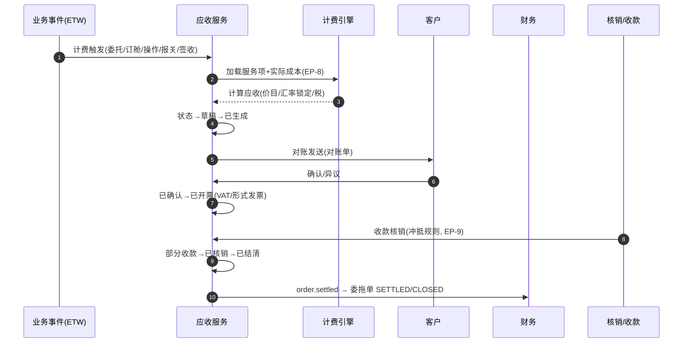

# 财务（Finance）深化设计 v4.0

> 依据：`13-第二轮深化设计-总览` 第二节模板；基线：`10-财务业务细化-v3.0`、`02/九`.
> 本轮重点：**应收/应付/收款/付款/对账五套状态转换表、自动计费事件驱动、汇率锁定与折算、Saga、信用与坏账、利润快照、EP-8/EP-9**。

---

## 一、目标与范围再确认

财务是"结案回款"的终点。v4 强化五件事：

1. **AR/AP/收款/付款/对账**五套**全量状态转换表**与互相锚定。
2. **自动计费引擎事件驱动**（委托确认/订舱确认/操作/报关/签收→费用），锁定汇率折算。
3. **收款核销/付款核销/对账**的确定性规则与门禁（`EP-8` 记账、`EP-9` 核销）。
4. **汇率锁定 + 利润快照 + 信用/坏账**口径，支撑关账 `SETTLED→CLOSED`（委拖单）。
5. **Saga/对账一致性**：跨模块费用与现金流的可追溯。

---

## 二、端到端时序图

### 2.1 应收（AR）主时序



### 2.2 应付（AP）+ 付款主时序

```
供应商对账 → 系统核对 → 确认 → 收票 → 付款申请 → 审批(按金额路由) → 出纳付款
   → 银行回执 → 已付款 → 付款核销(关联应付) → 红冲/更改审批
```

---

## 三、状态机转换表（五套）

### 3.1 应收（AR）— 沿用 v3

| 始态 | 终态 | 触发 | 守卫 | 动作 | 事件 | 权限 |
| --- | --- | --- | --- | --- | --- | --- |
| 草稿 | 已生成 | 计费触发 | 服务项/汇率齐 | 锁汇率、预占用信用 | `ar.generated` | 系统 |
| 已生成 | 已对账 | 客户对账 | 对账单确认 | 推送对账 | `ar.reconciling` | 财务 |
| 已对账 | 已确认 | 客户确认 | 无异议 | 可开票 | `ar.confirmed` | 客户/财务 |
| 已确认 | 已开票 | 开票 | 发票号码 | 通知客户 | `ar.issued` | 财务 |
| 已开票 | 部分收款/已收款 | 收款核销 | 收款匹配 | 更新余额 | `ar.allocated` | 财务 |
| 已开票 | 红冲 | 冲销 | 审批+票据 | 冲销建档 | `ar.credited` | 财务/主管 |
| 已生成 | 撤回/作废 | 撤单、作废 | 审批 | 释放信用 | `ar.voided` | 财务/主管 |
| 已对账 | 客户异议 | 异议 | 争议处理 | 工单/重对 | `ar.disputed` | 客户/客服 |

### 3.2 应付（AP）

| 始态 | 终态 | 触发 | 守卫 | 动作 | 事件 |
| --- | --- | --- | --- | --- | --- |
| 草稿 | 已对账 | 供应商对账单 | 系统比对 | 差异记录 | `ap.reconciling` |
| 已对账 | 已确认 | 核对一致 | 无 | 待收票 | `ap.confirmed` |
| 已确认 | 已收票 | 收到发票 | 票税一致 | 待付款 | `ap.invoiced` |
| 已收票 | 部分付款/已付款 | 付款核销 | 付款匹配 | 更新应付 | `ap.paid` |
| 已对账 | 退回 | 差异协商失败 | 审批 | 退回供应商 | `ap.returned` |
| 各态 | 红冲/作废 | 冲销、作废 | 审批 | 冲销建档 | `ap.credited` |

### 3.3 收款（Payment Received）

| 始态 | 终态 | 触发 | 守卫 | 动作 | 事件 |
| --- | --- | --- | --- | --- | --- |
| 待核 | 已核 | 确认到账 | 银行/接口对账 | 入账 | `pm.received` |
| 已核 | 已认领 | 客户认领 | 认领规则 | 挂应收 | `pm.claimed` |
| 已认领 | 已核销 | 核销 | 冲抵规则（EP-9） | 减少应收 | `pm.allocated` |
| 待核 | 作废/红冲 | 冲销 | 审批 | 冲销 | `pm.voided` |

### 3.4 付款（Payment Paid）

| 始态 | 终态 | 触发 | 守卫 | 动作 | 事件 |
| --- | --- | --- | --- | --- | --- |
| 草稿 | 待审批 | 付款申请 | 预算/供应商 | 路由审批 | `pay.submitted` |
| 待审批 | 已批准 | 审批通过 | 金额门禁 | 出纳+大额复核 | `pay.approved` |
| 已批准 | 已付款 | 银行反馈 | 付款成功 | 生成流水 | `pay.paid` |
| 已付款 | 已核销 | 核销 | 关联应付 | 更新应付 | `pay.allocated` |
| 待审批/已批准 | 驳回/作废 | 驳回、作废 | 审批 | 关闭 | `pay.rejected` |

### 3.5 对账（Statement）

| 始态 | 终态 | 触发 | 守卫 | 动作 | 事件 |
| --- | --- | --- | --- | --- | --- |
| 草稿 | 已发送 | 账面汇总 | 期间+客户 | 发送客户 | `stm.sent` |
| 已发送 | 已确认 | 客户确认 | 无异议 | 锁定 | `stm.confirmed` |
| 已发送 | 客户异议 | 争议 | 差异清单 | 争议处理 | `stm.disputed` |
| 已确认/已发送 | 已关闭 | 结清归档 | 余额清零 | 归档 | `stm.closed` |
| 各态 | 作废 | 作废 | 审批 | 重开期间 | `stm.voided` |

---

## 四、字段联动与计算规则

| 场景 | 规则 |
| --- | --- |
| 自动计费 | 事件触发→加载服务项→EP-8 插入价格/税/汇率 |
| 汇率折算 | 即时/锁定/月末三类汇率；非本币换算 |
| 毛利 | 售价(AR)-成本(AP) - 分摊 |
| 利润快照 | 按委托单固化，防止后续调整漂移 |
| 信用占用 | 委托单费用→占用；结清→释放 |
| 账龄 | 按开票日/到期日分区 |
| 坏账 | 判定+计提审批（与信用联动） |
| 提成 | 按利润/回款规则联动（销售） |
| 关账 | 委拖单需余额清零+审计通过→CLOSED |

---

## 五、领域事件进出清单

| 事件 | 方向 | 说明 |
| --- | --- | --- |
| `ar.generated/issued/allocated` | 发布 | 委拖单结算、信用、对账、报表 |
| `ap.invoiced/paid` | 发布 | 应付对账、现金流 |
| `pm.received/claimed/allocated` | 发布 | 核销、信用释放 |
| `pay.approved/paid` | 发布 | 付款、供应商账 |
| `stm.sent/confirmed/disputed` | 发布 | 对账、争议 |
| `fx.locked/rateChanged` | 发布/订阅 | 报价→开票汇率一致性 |
| `order.settled` | 发布 | 委拖单 CLOSED 前置 |
| `customer.creditChanged` | 订阅 | 接单/开票时复核信用 |

---

## 六、可扩展点与参数化（EP-8 / EP-9 聚焦）

| 扩展点 | 时机 | 可插入能力 | 作用域 |
| --- | --- | --- | --- |
| 记账（EP-8） | 费用生成 | 价目/税/汇率/冲抵策略 | 租户/客户/业务线 |
| 核销（EP-9） | 收款/付款 | 冲抵顺序/优先级/预警 | 租户/客户 |
| 审批流 | 付款/冲销/坏账 | 金额门禁、级联审批 | 租户/组织 |
| 对账周期 | 对账 | 客户维度周期/模板 | 客户 |
| 利润口径 | 快照 | 成本分摊/费用归集 | 租户/业务线 |
| 提成规则 | 计佣 | 按利润/回款可配 | 租户/销售 |

### 6.1 参数化建议

| 参数 | 默认 | 说明 |
| --- | --- | --- |
| `fin.ar_trigger` | 事件表 | 计费触发策略 |
| `fin.fx_lock_on_accept` | true | 采纳锁汇率 |
| `fin.payment_2fa` | 大额/海外 | 付款双人复核阈值 |
| `fin.aging_buckets` | 30/60/90 | 账龄区间 |
| `fin.bad_debt_days` | 180 | 坏账计提阈值 |
| `fin.statement_cycle` | 客户级 | 对账周期 |

---

## 七、异常补充、指标口径、待 V5 深化项

### 7.1 异常补充

| 场景 | 处理 |
| --- | --- |
| 汇率波动 | 未锁定重算、已锁定走锁价（预警） |
| 收款待核/挂账 | 认领流程+人工核销 |
| 争议账单 | 差异清单+对账重开+工单 |
| 付款驳回 | 原因留痕+重新审批 |
| 坏账/红冲 | 审批+凭证+审计 |
| 关账被阻断 | 列出未清原因 |

### 7.2 指标口径

| 指标 | 口径 |
| --- | --- |
| 应收账龄/DSO | 按开票日 |
| 应付/DPO | 按确认日 |
| 回款率 | 本期待收 / 收款 |
| 毛利率/客户利润 | 委托单快照 |
| 坏账率 | 计提/应收 |
| 关账时效 | DELIVERED→CLOSED |

### 7.3 待 V5 深化项

- 分润/多级代理分摊模型与确定性算法。
- 与金蝶/用友/SAP 凭证同步的完整映射与对账。
- 汇兑损益与多币种合并报表口径。
