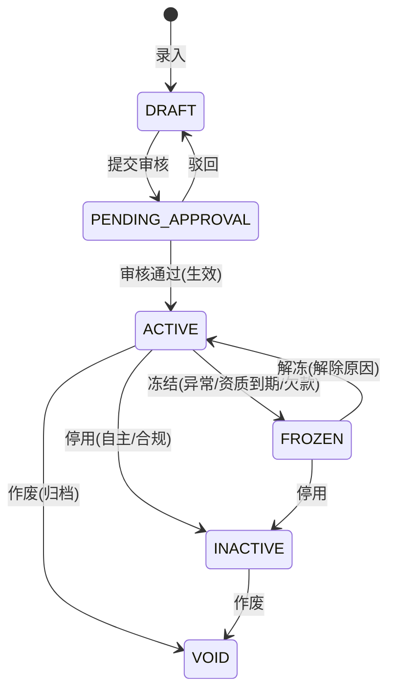
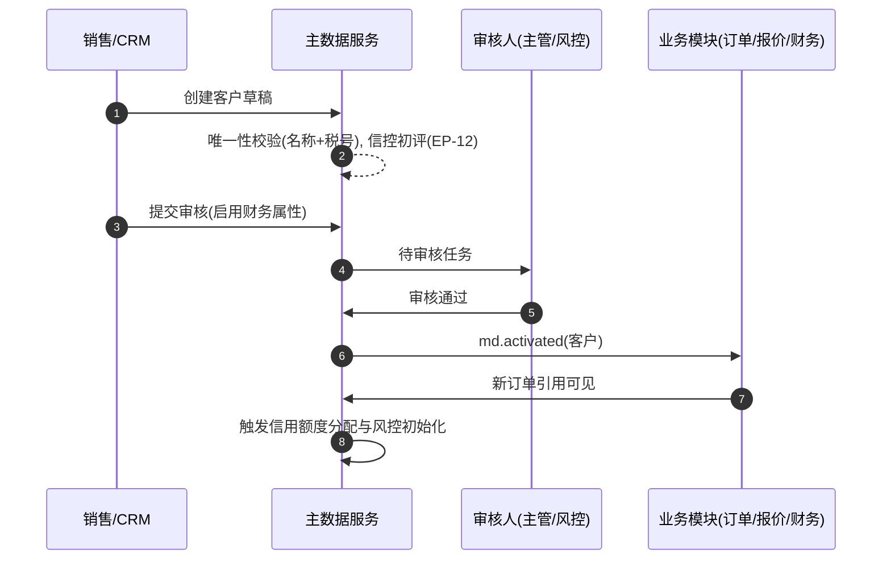
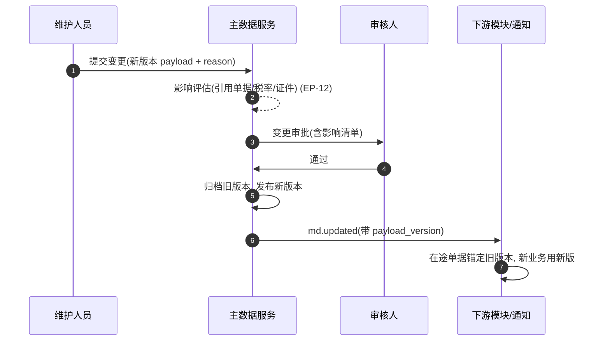

# 基础资料（Master Data）深化设计 v4.0

> 依据：`13-第二轮深化设计-总览` 第二节模板；基线：`03-基础资料业务细化-v3.0`、`02/二`.
> 本轮重点：**主数据生命周期状态机、版本化、变更审批/合并、字典与扩展字段、EP-12**。

---

## 一、目标与范围再确认

主数据是"地基"。v4 在 v3（实体/字段/规则/初始化）基础上强化三件事：

1. 给每类主数据定义**统一生命周期状态机**（草稿→待审核→生效→冻结→停用/作废），把"新增/变更/停用"从文字步骤升级为可执行状态流转。
2. 落实**版本化 + 自动合并/拆分 + 变更审批**，保障唯一性、可追溯、可回滚。
3. 界定**字典 / 扩展字段 / 组合业务视图**三类扩展机制，支撑多模式、多组织按需扩展而不改核心表。

---

## 二、主数据统一生命周期状态机

所有主数据实体共用一套主状态机（各实体在其上叠加专属子状态）：

### 2.1 主状态机（通用）

### 2.2 通用转换表（各实体按需裁剪）

| 始态 | 终态 | 触发 | 守卫 | 动作 | 事件 | 权限 |
| --- | --- | --- | --- | --- | --- | --- |
| DRAFT | PENDING_APPROVAL | 提交 | 必填完整、唯一性校验 | 发起审批 | `md.submitted` | 录入人 |
| PENDING_APPROVAL | ACTIVE | 审核通过 | 审批流通过 | 生效并广播 | `md.activated` | 审核人/主管 |
| PENDING_APPROVAL | DRAFT | 驳回 | 驳回理由 | 通知修改 | `md.rejected` | 审核人 |
| ACTIVE | FROZEN | 触发冻结 | 冻结原因（资质/欠款/绩效） | 阻断新引用 | `md.frozen` | 系统/主管 |
| FROZEN | ACTIVE | 解冻 | 原因消除+审批 | 恢复引用 | `md.unfrozen` | 主管 |
| ACTIVE/FROZEN | INACTIVE | 停用 | 无未结引用评估通过 | 停新引用，保留历史 | `md.inactivated` | 主管 |
| ACTIVE/INACTIVE | VOID | 作废 | 主管审批+归档 | 归档，全链只读 | `md.voided` | 主管/SuperAdmin |

### 2.3 各实体专属状态语义

| 实体 | 专属子状态 / 维度 | 说明 |
| --- | --- | --- |
| 客户 | 信用状态（正常/预警/冻结）、黑名单、分级 | 冻结影响下单（EP-2 信用联动） |
| 合作方 | 资质有效期、绩效分级、服务状态 | 资质到期提前预警，过期冻结 |
| 承运人/船公司 | 服务状态、航线可用 | 临时停航→标记并推荐替代（EP-2/EP-3 联动） |
| 港口/机场 | UN/LOCODE 状态、运营状态 | 临时关闭→禁用+替代港 |
| HS 编码 | 年度版本、监管证件要求 | 版本化，税率变更自动预警 |
| 仓库 | 容量、温控状态、业务类型 | 满仓/温控异常→禁约+预警 |
| 币种/国家 | 启用状态 | ISO 主数据，只增不删 |

---

## 三、端到端时序图

### 3.1 客户档案"新增-审核-生效-引用"时序

### 3.2 主数据"变更-审批-版本"时序（以 HS 编码 / 船公司为例）

---

## 四、字段联动与计算规则

| 场景 | 联动规则 | 锁定/校验时机 |
| --- | --- | --- |
| 客户类型→默认账期/信用 | 主数据默认，可覆写但留痕 | 创建时 |
| 分级重算 | 每月1日按货量/收入自动重算 | 分级提交需审核 |
| 合作方资质→服务状态 | 到期提前30天预警，逾期冻结 | 每日批处理 |
| HS 税率变更 | 版本化，变更通知下游报关 | 出版本时广播 |
| 港口/航线变更 | 禁用或替换，在途单据锚定原值 | 变更评估通过后 |
| 合并/拆分 | 旧冻结+新生效+在途单据挂接新档案 | 合并审批 |

---

## 五、领域事件进出清单

| 事件 | 方向 | 发布/订阅 | 消费方/效果 |
| --- | --- | --- | --- |
| `md.submitted/activated/updated/frozen/…` | 发布 | 主数据 | 全业务模块刷新、通知、审计 |
| `customer.creditChanged` | 发布 | 客户/信控 | 风控、信用占用刷新、下单校验 |
| `partner.statusChanged` | 发布 | 合作方 | 订舱/绩效/成本锁定 |
| `hs.updated` | 发布 | HS | 报关预归类、税率预警 |
| `port.closed` / `warehouse.capacity` | 发布 | 港口/仓库 | 路由推荐、预约管控 |
| `customer.merged` | 发布 | 客户 | 在途单据重挂接、统一视图 |

---

## 六、可扩展点与参数化（EP-12 聚焦）

| 扩展点 | 时机 | 可插入能力 | 作用域 |
| --- | --- | --- | --- |
| 唯一性/合并校验（EP-12） | 新建/变更前 | 相似度匹配、自动合并、别名库 | 租户/实体 |
| 审批流 | 提交审核 | 条件路由、会签、分级审批 | 实体×金额/等级 |
| 生效前副作用 | 生效时 | 初始化授信、建立默认价目 | 租户/实体 |
| 冻结/停用评估 | 冻结/停用前 | 评估未结引用、级联停用 | 租户/实体 |
| 字典扩展 | 任意 | 新增枚举值（柜型/状态/费用类型…） | 租户 |
| 扩展字段 | 任意 | EAV/JSON 承载个性化（SKU 属性、行业字段） | 客户/模式 |

### 6.1 参数化建议（示例默认值）

| 参数 | 默认 | 说明 |
| --- | --- | --- |
| `md.require_approval` | 分级 | 大客户/合作方启用需审核开关 |
| `md.partner_license_advise_days` | 30 | 资质到期预警 |
| `md.auto_merge_enabled` | false | 自动合并开关（默认人工） |
| `md.dup_similarity_threshold` | 0.9 | 名称相似度合并阈值 |
| `md.hs_version_auto_broadcast` | true | HS 年度版本自动广播 |
| `md.freeze_on_overdue_days` | 配置 | 客户欠款冻结阈值 |

---

## 七、异常补充、指标口径、待 V5 深化项

### 7.1 异常补充

| 场景 | 处理 |
| --- | --- |
| 同名不同公司 | 以税号/信用代码区分，别名维护 |
| 客户合并 | 旧冻结+新建+在途单据挂接，审计留痕 |
| 合作方资质到期 | 30天预警→冻结→推荐替代 |
| HS 税率变更 | 版本化+下游预警，在途锚定旧版 |
| 港口临时关闭 | 禁用+替代路由推荐 |
| 仓库满仓/温控异常 | 禁约+冷藏货异常工单 |

### 7.2 指标口径

| 指标 | 口径 |
| --- | --- |
| 主数据完整率 | 各实体必填字段达标比 |
| 审核/生效时效 | 提交→生效平均时长 |
| 合并率/重复率 | 重复档案检出与合并量 |
| 废止引用风险 | 停用评估涉及的在途单据数 |

### 7.3 待 V5 深化项

- 跨法人/跨租户主数据共享与推送规则。
- HS 编码与各国监管（AMS/ENS/AFR）的系统级映射。
- 客户/合作方征信评分模型的确定性口径与数据源。
