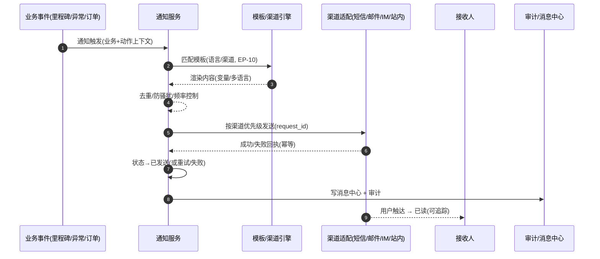

# 通知与系统（Notification / System）深化设计 v4.0

> 依据：`13-第二轮深化设计-总览` 第二节模板；基线：`12-通知系统业务细化-v3.0`、`02/十一~十三`.
> 本轮重点：**通知发送状态机、模板变量与多语言、渠道策略与防骚扰、发送管道 EP-10、审计/编号/字典/工作日等系统能力**。

---

## 一、目标与范围再确认

通知与系统是"触达与底座"能力。v4 强化四件事：

1. **通知发送状态机**（待发送→发送中→已发送/失败/重试→已读/退订）与失败重试、防骚扰节流。
2. **模板变量 + 多语言 + 渠道优先级**策略（EP-10），按业务/紧急度路由。
3. **操作审计、编码规则、系统字典、工作日**四类系统能力与各模块的交互。
4. 与其他模块"事件驱动发通知"的一致性接入约定。

---

## 二、端到端时序图

### 2.1 通知发送主时序



### 2.2 审计/编码/字典（系统能力）

```
各业务写操作 → 操作日志(谁/何时/改了什么/旧新值) → 审计查询/留痕
业务单号 → 按编码规则生成(前缀+日期+流水) → 全局唯一/冲突处理
枚举值 → 字典集中管理 → 前端/校验/报表统一引用
工作日 → 影响SLA/ETA/自动任务计算
```

---

## 三、状态机转换表（通知）

### 3.1 通知发送

| 始态 | 终态 | 触发 | 守卫 | 动作 | 事件 | 权限 |
| --- | --- | --- | --- | --- | --- | --- |
| 待发送 | 发送中 | 出队发送 | 渠道+模板有效 | 调用渠道 | `nt.sending` | 系统 |
| 发送中 | 已发送 | 渠道成功 | 幂等去重 | 写回执 | `nt.sent` | 系统 |
| 发送中 | 发送失败 | 渠道失败 | 重试未超 | 计划重试 | `nt.failed` | 系统 |
| 发送失败 | 发送中 | 重试（1/5/30min）≤3 | 无 | 重新发送 | `nt.retrying` | 系统 |
| 发送失败 | 失败终态 | 重试耗尽 | 无 | 工单/告警 | `nt.dead` | 系统/人工 |
| 已发送 | 已读 | 用户阅读 | 可追踪渠道 | 回执 | `nt.read` | 系统 |
| 已发送 | 退订 | 用户退订 | 无 | 标记偏好 | `nt.unsubscribed` | 用户 |

---

## 四、模板 / 渠道 / 防骚扰

| 场景 | 渠道优先级 |
| --- | --- |
| 紧急（异常/SLA） | 短信→邮件→微信 |
| 普通（订单确认） | 邮件→站内 |
| 国际客户 | 邮件→WhatsApp |
| 内部 | 钉钉/飞书→邮件 |

**多语言**：模板按语言（中/英/西/日/韩）渲染；变量从业务事件上下文注入，缺失时占位并预警。
**防骚扰**：同类型聚合（如多跟踪事件）、每日渠道上限、退订通道。

---

## 五、领域事件进出清单

| 事件 | 方向 | 说明 |
| --- | --- | --- |
| `nt.sent/read` | 发布 | 消息中心、触达率统计 |
| `nt.failed/dead` | 发布 | 告警、工单 |
| `notification.trigger_*` | 订阅 | 各模块业务事件→发通知（EP-10） |
| `audit.written` | 发布 | 审计留痕 |
| `code.allocated` | 发布 | 编号冲突检测 |

---

## 六、可扩展点与参数化（EP-10 聚焦）

| 扩展点 | 时机 | 可插入能力 | 作用域 |
| --- | --- | --- | --- |
| 模板渲染（EP-10） | 发送前 | 变量/条件/多语言 | 租户/客户/业务 |
| 渠道选择 | 出队前 | 渠道优先级/成本/退订 | 租户/类型 |
| 防骚扰 | 出队前 | 聚合/节流/上限 | 租户/渠道 |
| 渠道适配器 | 发送 | 新渠道注册 | 租户 |
| 审计范围 | 写操作 | 增删查敏感字段 | 租户/模块 |
| 编号规则 | 生成单号 | 前缀/日期/流水可配 | 租户/单据 |

### 6.1 参数化建议

| 参数 | 默认 | 说明 |
| --- | --- | --- |
| `nt.retry_times` | 3 | 重试次数 |
| `nt.retry_interval` | 1/5/30min | 重试间隔 |
| `nt.daily_per_channel` | 可配 | 防骚扰上限 |
| `nt.lang_default` | zh | 默认语言 |
| `sys.audit_retention_years` | 5 | 日志保留 |
| `sys.code_conflict_retry` | 重复校验 | 编号冲突处理 |

---

## 七、异常补充、指标口径、待 V5 深化项

### 7.1 异常补充

| 场景 | 处理 |
| --- | --- |
| 渠道不可用 | 降级渠道重试→失败终结 |
| 模板变量缺失 | 占位+渲染告警 |
| 多语言缺失 | 回落默认语言 |
| 编号冲突 | 重复校验+重试 |
| 退订误触 | 用户偏好+客服恢复 |

### 7.2 指标口径

| 指标 | 口径 |
| --- | --- |
| 送达率 | 已发送/待发送 |
| 触达/已读率 | 已读/已发送 |
| 失败/重试率 | 失败/重试占比 |
| 模板渲染错误率 | 变量缺失占比 |
| 审计完整率 | 覆盖模块×操作 |

### 7.3 待 V5 深化项

- 消息中心多端（门户/App/IM）统一已读/未读同步。
- 通知模板自动化测试与灰度（A/B）。
- 与外部系统（企微/钉钉/WhatsApp）模板与审批流的深度整合。
