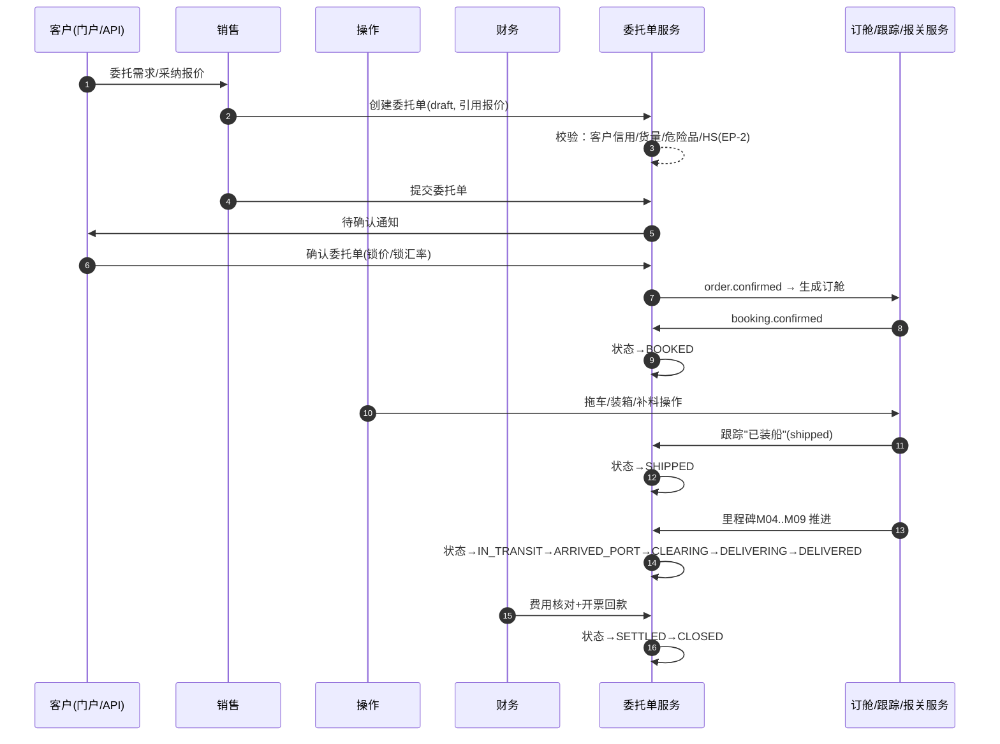

# 委托单（Order）深化设计 v4.0

> 依据：`13-第二轮深化设计-总览` 第二节模板；基线：`05-委托单业务细化-v3.0`、`02/4`.
> 状态代号与 v3 完全一致，本版本补强 **时序、全量转换表、事件、字段联动、扩展点**。

---

## 一、目标与范围再确认

委托单（Order）是国际物流业务的**合同级主干单据**，向上承接报价/商机，向下驱动订舱、操作、报关、仓储、财务与跟踪。v4 重点：

1. 把"文字流程"升级为**可执行时序**（谁、何时、做什么、结果、回滚）。
2. 给出**全量状态转换表**（守卫、动作、事件、权限），支撑状态机可配置化。
3. 明确**领域事件进出**，使委托单与各模块"松耦合"衔接。
4. 登记**扩展点 EP-2**及参数化项，支撑不同业务模式（直客/同行/电商/项目）。

### 1.1 三类业务形态（模式化，不炸表）

| 模式 | 关键差异 | 落在哪些配置/字段 |
| --- | --- | --- |
| 直客货代 | 强 SLA、品牌化单证 | 通知模板、SLA、客户协议价 |
| 同行委托 | 分润/多级代理、毛利控制 | 费率链、授权采购价 |
| 电商/项目 | SKU/批次/箱唛、高频小单 | 扩展字段、费用聚合、WMS 联动 |

> 三类共享同一状态机与主链路，差异通过 `order_type`/`service_items`/扩展字段/规则作用域收敛，避免建多套模型。

---

## 二、端到端时序图

### 2.1 海运 FCL 出口主时序

### 2.2 前置/后置条件（分段执行语义）

| 阶段 | 前置条件 | 后置结果 | 失败处理 |
| --- | --- | --- | --- |
| 创建（存草稿） | 客户有效、业务数据齐 | 生成 `order_no` | 保存失败可重试（幂等键） |
| 提交 | 必填项完整、危险品/信用校验过 | →`PENDING_CONFIRM` | 驳回并返回校验明细 |
| 确认 | 报价/费用预算齐、信用额度充足 | 锁价+锁汇率 →`CONFIRMED` | 授信不足→提示提额/改预付 |
| 下订舱 | 已确认 | 生成订舱 | 订舱失败→Saga 回滚至已确认 |
| 操作/发运 | 单证齐（SI/装箱/报关放行） | 里程碑推进 | 缺单证→挂起并预警 |
| 结算/关账 | 费用闭环、余额清零、审计通过 | `SETTLED`→`CLOSED` | 未清→阻断关账列出原因 |

---

## 三、状态机转换表（全量 15 状态）

> 守卫列 = 可配置规则；动作/事件列 = 状态变更的副作用。

| 始态 | 终态 | 触发 | 守卫 | 动作 | 事件 | 权限 |
| --- | --- | --- | --- | --- | --- | --- |
| DRAFT | PENDING_CONFIRM | 提交 | 必填完整、信用/危险品/HS 校验 | 发起确认通知 | `order.submitted` | 销售/系统 |
| DRAFT | CANCELLED | 取消 | 无已发生费用 | 释放占用 | `order.cancelled` | 销售 |
| PENDING_CONFIRM | CONFIRMED | 客户确认 | 费用预算齐、授信足 | 锁价锁汇率、生成订舱 | `order.confirmed` | 客户/销售 |
| PENDING_CONFIRM | DRAFT | 要求修改 | 未超时 | 移除确认通知 | `order.returned` | 销售 |
| PENDING_CONFIRM | VOID | 超时未确认 | 超时策略 | 作废登记 | `order.voided` | 系统/销售 |
| CONFIRMED | BOOKED | ≥1 订舱确认 | 订舱成功 | 生成订舱、扣舱位 | `booking.created` | 系统/操作 |
| CONFIRMED | CANCELLED | 客户取消 | 违约金/费用处理 | 释放资源、按费撤单 | `order.cancelled` | 销售主管 |
| BOOKED | IN_OPERATION | 任一操作开始 | 已订舱 | 生成作业任务 | `ops.started` | 操作 |
| BOOKED | CANCELLED | 客户取消 | 撤单规则 | 撤订舱、释舱 | `order.cancelled` | 销售主管 |
| IN_OPERATION | SHIPPED | 跟踪"装船/起飞" | 单证齐全、放行 | 里程碑 M-04 | `milestone.reached` | 系统/操作 |
| SHIPPED | IN_TRANSIT | 跟踪在途 | 无 | M-05 | `milestone.reached` | 系统 |
| IN_TRANSIT | ARRIVED_PORT | 跟踪抵港 | 无 | M-06 | `milestone.reached` | 系统 |
| ARRIVED_PORT | CLEARING | 报关申报 | 清关单据齐 | — | `customs.submitted` | 系统/关务 |
| CLEARING | DELIVERING | 清关放行 | 查验/放行通过 | 触发提货派送 | `customs.released` | 系统/操作 |
| DELIVERING | DELIVERED | 跟踪签收 | 无 | M-09 | `milestone.reached` | 系统 |
| DELIVERED | SETTLED | 财务结算 | 费用闭环 | 开票/对账 | `order.settled` | 财务 |
| SETTLED | CLOSED | 财务关账 | 余额清零、审计通过 | 锁定归档 | `order.closed` | 财务主管 |
| *（各进行态） | CANCELLED | 撤单 | 撤单窗口+违约金规则 | 资源回滚/释放 | `order.cancelled` | 销售主管 |
| *（有效态） | VOID | 作废 | 主管审批 | 冻结/归档 | `order.voided` | 主管/系统 |

### 3.1 状态机可配置化要点

- 新状态/新转换 = 新增配置行，不改代码（正文"加状态"能力）。
- **禁止逆向安全**：进入 `CLOSED/VOID` 后不可再编辑业务字段，只读+审计。
- **分支一致**：`MULTIMODAL` 主状态=段状态合并（子委托），段独立推进。

---

## 四、字段联动与计算规则（自动带出 / 校验 / 锁定）

| 字段 | 联动来源 | 规则 | 锁定时机 |
| --- | --- | --- | --- |
| `order_no` | 编码规则表 | 全局唯一 | 创建后锁定 |
| `customer_credit` 校验 | 客户授信 | 可用信用≥预估金额 | 提交时 |
| 预估费用/费用预算 | 报价明细/自身服务项 | 按费用项聚合 | 确认时（可锁价） |
| 锁定汇率 | 财务事件域 | 报价锁定→开票沿用 | 确认时 |
| 服务项（service_items） | 自动按业务类型生成 | 按模板/规则装配 | 编辑期 |
| 段状态/里程碑 | 子委托/跟踪 | 合并算法汇总 | 只读派生 |
| 危险品/HS 强校验 | 关务/主数据 | 资质+监管证件 | 提交时 |
| 关联单据清单 | 各下游模块 | 动态回填 | 只读 |

---

## 五、领域事件进出清单

### 5.1 发布（`order.*` 域）

| 事件 | 触发状态 | 订阅方 | 用途 |
| --- | --- | --- | --- |
| `order.submitted` | 提交 | CRM、通知 | 待确认提醒、商机回收 |
| `order.confirmed` | 确认 | 订舱、财务、通知 | 发起订舱、信用占用、锁价 |
| `order.cancelled` | 取消 | 订舱、财务、通知 | 释放舱位/信用、违约金入账 |
| `order.voided` | 作废 | 跟踪、财务 | 冻结跟踪、冲销 |
| `order.settled` | 结算 | 报表、通知 | 结案口径 |
| `order.closed` | 关账 | 归档/审计 | 关账锁定 |

### 5.2 订阅（入账到委托单）

| 事件 | 发布方 | 效果 |
| --- | --- | --- |
| `booking.confirmed` | 订舱 | →BOOKED |
| `ops.started` | 操作 | →IN_OPERATION |
| `tracking.shipped / milestone.reached` | 跟踪 | 推进 SHIPPED→IN_TRANSIT…DELIVERED |
| `customs.submitted / released` | 关务 | →CLEARING / →DELIVERING |
| `fx.locked` | 财务 | 记录锁定汇率 |
| `ar.issued / payment.received` | 财务 | 推进 SETTLED |

> 所有入账均按 `event_id` 幂等、可重放；异常回滚用 Saga（订舱失败→回 `CONFIRMED`）。

---

## 六、可扩展点与参数化（EP-2 为主）

| 扩展点 | 时机 | 可插入能力 | 作用域 |
| --- | --- | --- | --- |
| 校验（EP-2） | 提交/确认前 | 追加必填、风控、信用、合规 | 租户/客户/模式 |
| 费用计算 | 创建预估/结算 | 自定义费用项、联动物料 | 租户/模式 |
| 单证模板 | 生成单证时 | 按客户/航线定制 | 客户/航线 |
| 通知策略 | 状态变更 | 渠道/变量/去重 | 租户/客户 |
| 段状态扩展 | 多式联运 | 新增段类型与交接节点 | 模式 |
| 扩展字段 | 任意 | EAV/JSON 承载个性化 | 客户/模式 |

### 6.1 参数化建议（示例默认值）

| 参数 | 默认 | 说明 |
| --- | --- | --- |
| `order.timeout_confirm_days` | 3 | 超时未确认→作废 |
| `order.credit_check_enabled` | true | 提交时授信校验开关 |
| `order.cancel_fee_rule` | 配置 | 各阶段撤单违约金 |
| `order.auto_booking` | 委托模式 | 确认后是否自动下订舱 |
| `order.segment_merge_rule` | 配置 | 多式联运段合并算法 |

---

## 七、异常补充、指标口径、待 V5 深化项

### 7.1 异常补充

| 场景 | 处理 |
| --- | --- |
| 订舱失败 | Saga 回滚→CONFIRMED，重试/换承运人 |
| 客户超时未确认 | 自动作废 VOID + 通知销售 |
| 授信不足 | 提示提额/改预付，挂起不确认 |
| 危险品/HS 证件缺失 | 阻断提交，（EP-6 联动关务） |
| 中途撤单跨结算 | 违约金+资源释放，费用结算 |
| 子段异常跨界 | 触发异常升级，跨段回溯责任（07/3.6） |

### 7.2 指标口径（与里程碑对齐）

| 指标 | 口径 | 来源 |
| --- | --- | --- |
| 订单确认时效 | 创建→CONFIRMED | 事件时间差 |
| 订舱时效 | CONFIRMED→BOOKED | 事件时间差 |
| 在途时长/全程时效 | 里程碑 M04→M09 | 里程碑表 |
| 撤单率/作废率 | 取消+作废 / 全部 | 事件计数 |
| 结算关账时效 | DELIVERED→CLOSED | 事件时间差 |
| 超 SLA 单 | 里程碑间超时 | SLA 规则 |

### 7.3 待 V5 深化项

- 多式联运段级状态机的完整转换表与交接事件。
- 委托单与合同/协议台账的关联与留痕（法务）。
- 直客/同行分润分摊模型与费用聚合的确定性算法。
- 电商高频小单的批量提交/合并/SKU 维度成本口径。
