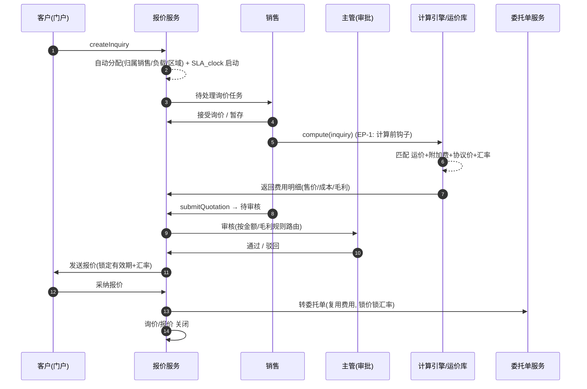

# 询价与报价（Quotation）深化设计 v4.0

> 依据：`13-第二轮深化设计-总览` 第二节模板；基线：`04-询价报价业务细化-v3.0`、`02/三`.
> 本轮重点：**询价/报价全量状态转换表、报价计算引擎时序、SLA 追踪、锁价/锁汇率、EP-1、转委托确定性**。

---

## 一、目标与范围再确认

询价→报价是业务入口链路。v4 强化三件事：

1. 询价与报价的**全量状态转换表**（含守卫、动作、事件、权限）与 SLA 自动推进。
2. **报价计算引擎时序**与**锁价/锁汇率**确定性规则，保证"报价→委托→开票"币价一致。
3. 登记 **EP-1（计算前/后、调价/审批）** 与参数化，支撑自动/人工/协议/项目混合报价。

---

## 二、端到端时序图

### 2.1 询价→报价→转委托 主时序



### 2.2 自动报价（直客/电商直出）

```
客户在线询价 → 系统匹配(运价+附加费+协议) → 自动报价(EP-1 价后校验)
   → 命中毛利与风控阈值 → 直接发送 / 转人工审核
```

> 关键：自动报价必须内置**毛利护栏 + 授信初评**，避免破价或超额。

---

## 三、状态机转换表

### 3.1 询价（Inquiry）全量

| 始态 | 终态 | 触发 | 守卫 | 动作 | 事件 | 权限 |
| --- | --- | --- | --- | --- | --- | --- |
| 待分配 | 已分配 | 自动/手动分配 | 有可用销售 | SLA 时钟启动 | `inquiry.assigned` | 主管/系统 |
| 待分配 | 已撤回 | 客户撤回 | 无已报价 | 关闭 | `inquiry.withdrawn` | 客户/销售 |
| 已分配 | 报价中 | 接受询价 | 未超 SLA | 暂存开始 | `inquiry.accepted` | 销售 |
| 已分配 | 转销售 | 退回/转单 | 审批 | 重新分配 | `inquiry.forwarded` | 销售/主管 |
| 报价中 | 已报价 | 发出报价 | 报价完整性校验 | 生成报价单 | `quotation.issued` | 销售/系统 |
| 已报价 | 已采纳 | 客户采纳 | 报价有效 | 触发转委托 | `quotation.accepted` | 客户 |
| 已报价 | 已拒绝 | 客户拒绝 | 无 | 关闭+原因 | `inquiry.rejected` | 客户 |
| 报价中/已报价 | 已过期 | 超有效期 | 超时策略 | 关闭 | `inquiry.expired` | 系统 |
| 已采纳 | 已关闭 | 转委托完成 | 委托创建 | 归档 | `inquiry.closed` | 系统 |
| 已拒绝/已过期/已撤回 | 已关闭 | 关闭 | 归档条件 | 归档 | `inquiry.closed` | 销售 |

### 3.2 报价（Quotation）全量

| 始态 | 终态 | 触发 | 守卫 | 动作 | 事件 | 权限 |
| --- | --- | --- | --- | --- | --- | --- |
| 草稿 | 待审核 | 提交 | 完整性+毛利护栏 | 路由审批 | `quotation.submitted` | 销售 |
| 待审核 | 审核驳回 | 驳回 | 驳回理由 | 退回草稿 | `quotation.rejected` | 主管 |
| 审核驳回 | 待审核 | 重新提交 | 已修正 | 重走审批 | `quotation.submitted` | 销售 |
| 待审核 | 已审核 | 通过 | 审批流通过 | 可发送 | `quotation.approved` | 主管 |
| 已审核 | 已发送 | 发送 | 锁价+锁汇率 | 通知客户 | `quotation.issued` | 销售/系统 |
| 已发送 | 客户已读 | 客户查看 | 无 | 跟进提醒 | `quotation.viewed` | 系统 |
| 已发送 | 已撤回 | 销售撤回 | 未采纳 | 编辑/关闭 | `quotation.withdrawn` | 销售 |
| 客户已读/已发送 | 已采纳 | 客户接受 | 未过期 | 转委托(锁价锁汇率) | `quotation.accepted` | 客户 |
| 已发送/客户已读 | 已拒绝 | 客户拒绝 | 无 | 关闭+原因 | `quotation.rejected` | 客户 |
| 已发送/客户已读 | 已过期 | 超有效期 | 超时 | 关闭 | `quotation.expired` | 系统 |
| 已采纳/已拒绝/已过期 | 已关闭 | 关闭 | 归档条件 | 归档 | `quotation.closed` | 销售 |
| 草稿/待审核 | 废弃 | 作废 | 审批 | 归档 | `quotation.voided` | 销售/主管 |

### 3.3 报价有效期与锁价/锁汇率规则

- 报价锁定三要素：**锁定费用明细（价）、锁定汇率对、锁定有效期**。
- 采纳→转委托时**沿用锁定价与锁定汇率**，后续开票不被市场波动影响（`13/8` 汇率条款）。
- 有效期过期仍被用户"采纳"时：触发`quotation.expired`并明确提示，需重新报价。
- 价目优先级（沿用 v3）：协议价 > 专属运价 > 公开运价 > 市场基准；同价档再按生效时间新胜旧。

---

## 四、字段联动与计算规则（报价计算引擎）

| 环节 | 联动来源 | 规则 |
| --- | --- | --- |
| 费用加载 | 运价+附加费+协议价 | 按优先级合并，去重冲抵 |
| 售价/成本 | 内部价目 vs 客户价目 | 成本=采购价，售价=协议/市场 |
| 毛利 | 售价-成本 | 低于护栏→拦截/审批（EP-1） |
| 币种/汇率 | 结算币种 | 非本币兑换，锁定时点汇率 |
| 税/费 | 附加费库 | 按触发规则计算 |
| 授信初评 | 客户分级/额度 | 采纳后预占用，转委托固化 |
| 有效期 | 策略+审批 | 倒计时自动过期 |

---

## 五、领域事件进出清单

| 事件 | 方向 | 发布方/消费方 | 用途 |
| --- | --- | --- | --- |
| `inquiry.assigned / accepted / expiry` | 发布 | 询价 | SLA 看板、提醒、销售考核 |
| `quotation.submitted / approved / issued` | 发布 | 报价 | 审批路由、通知、CRM 商机推进 |
| `quotation.accepted` | 发布 | 报价 | 委托单创建、信用占用、报价命中 |
| `quotation.rejected / expired` | 发布 | 报价 | 商机回收、重新报价、命中率 |
| `pm.rateChanged` | 订阅 | 运价库 | 刷新在途草稿的有效价目 |
| `fx.rateChanged` | 订阅 | 汇率 | 未锁定报价按新汇率重算 |
| `customer.creditChanged` | 订阅 | 客户 | 接收/采纳时授信复核 |

---

## 六、可扩展点与参数化（EP-1 聚焦）

| 扩展点 | 时机 | 可插入能力 | 作用域 |
| --- | --- | --- | --- |
| 计算前钩子（EP-1） | compute 前 | 补充价格/客户专属折扣/项目加成 | 客户/航线/模式 |
| 计算后校验 | compute 后 | 毛利护栏、破价拦截、审批路由 | 租户/客户 |
| 自动报价开关 | 报价前 | 全自动/半自动/人工 | 租户/客户/线路 |
| 报价模板 | 生成/发送 | 品牌化单据、条款、附件 | 客户/航线 |
| 价目扩展 | 涉及运价库 | 新增费用类型/算法 | 租户 |
| 询价分配 | 分配时 | 自定义分单规则 | 租户/销售组 |

### 6.1 参数化建议

| 参数 | 默认 | 说明 |
| --- | --- | --- |
| `quotation.rsp_by_customer` | 3h | 常规询价 SLA |
| `quotation.rsp_urgent_h` | 2h | 紧急询价 SLA |
| `quotation.auto_quote_enabled` | 客户级 | 自动报价开关 |
| `quotation.gross_margin_floor` | 8% | 毛利护栏；低于→审批 |
| `quotation.valid_days` | 7 | 默认有效期 |
| `quotation.lock_fx_on_accept` | true | 采纳时锁汇率 |

---

## 七、异常补充、指标口径、待 V5 深化项

### 7.1 异常补充

| 场景 | 处理 |
| --- | --- |
| 报价超 SLA | 分级升级（销售→主管→运营经理） |
| 运价库缺失 | 降级匹配+人工补价标记 |
| 破价/毛利低于护栏 | 拦截或强制走审批 |
| 有效期过期仍被采纳 | 明确提示需重报 |
| 汇率大幅波动 | 未锁定报价提醒，已锁定走锁价 |

### 7.2 指标口径

| 指标 | 口径 |
| --- | --- |
| 询价响应时效 | 分配→首报价 时长（按 SLA 分级） |
| 报价命中率 | 采纳数 / 报价数 |
| 询价转化率 | 转委托数 / 询价数 |
| 报价毛利率 | (售价-成本)/售价 均价 |
| 破价/审批率 | 需审批报价占比 |
| 销售报价能力 | 按销售：响应、命中、毛利 |

### 7.3 待 V5 深化项

- AI 辅助报价建议与运费走势预测的输入/输出契约。
- 项目物流/招投标多阶段报价（比价、议价、变更）模型。
- 多币种多价目捆绑报价与汇率套利风控规则。
