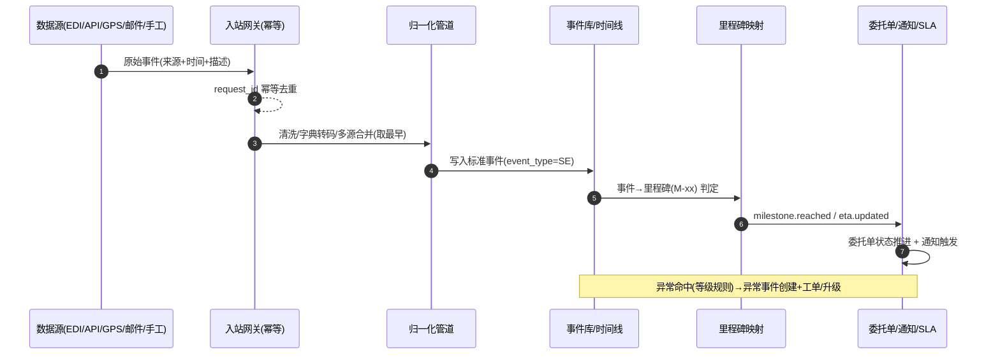

# 跟踪与异常（Tracking / Exception）深化设计 v4.0

> 依据：`13-第二轮深化设计-总览` 第二节模板；基线：`07-跟踪异常业务细化-v3.0`、`02/六`.
> 本轮重点：**事件归一化管道、里程碑映射、ETA 更新状态机、异常全量响应状态机、EP-5、SLA 自动升级**。

---

## 一、目标与范围再确认

跟踪是"实时可见"与"异常预警"的引擎。v4 强化四件事：

1. 把多源原始事件（EDI/API/GPS/邮件/手工）的**采集→归一化→发布**固化为管道（EP-5），保证去重、合并、标准事件类型。
2. 建立**标准事件→业务里程碑→委托单状态**的三级映射表，作为 SLA 与通知的唯一口径。
3. 定义**ETA 生命周期**（生成→刷新→置信→失效→确认），支撑可靠到港承诺。
4. 给出**异常事件全量响应转换表**（含等级、SLA、逐级升级、责任判定）。

---

## 二、端到端时序图

### 2.1 跟踪事件归一化管道（EP-5）



### 2.2 异常响应时序

```
异常识别(自动规则/人工) → 等级判定 → 通知处理人 → 受理(时钟启动)
   → 调查根因 → 制定方案 → 执行 → 客户沟通 → 解决 → 回访 → 关闭
   （超时→逐级升级：处理人→主管→运营经理）
```

---

## 三、状态机转换表

### 3.1 跟踪事件——管道处理状态

> 标准业务事件本身进入时间线后即"已发布"；管道层存在处理状态（不可见给业务的内部状态）。

| 始态 | 终态 | 触发 | 守卫 | 动作 | 事件 |
| --- | --- | --- | --- | --- | --- |
| RAW | NORMALIZED | 管道处理 | 时间/类型合法 | 字典转码、合并 | `tracking.normalized` |
| NORMALIZED | PUBLISHED | 发布判定 | 里程碑/时效匹配 | 写入时间线、映射簇 | `tracking.published` |
| NORMALIZED | DISCARDED | 去重/无效 | 重复或不可信 | 丢弃留痕 | `tracking.discarded` |
| PUBLISHED | ANOMALOUS | 命中异常规则 | 等级判定 | 创建异常事件 | `exception.created` |

### 3.2 标准事件 → 里程碑三层映射（口径）

| 标准事件 | 里程碑 | 委托单状态 | SLA 点 |
| --- | --- | --- | --- |
| 已装船/已起飞 | M-04 已装船 | SHIPPED | 截关→装船 |
| 在途 | M-05 已在途 | IN_TRANSIT | 全程时效 |
| 已到港/落地 | M-06 已到港 | ARRIVED_PORT | 运输时长 |
| 报关放行 | M-07 已放行 | CLEARING→DELIVERING | 清关时长 |
| 已派送 | M-08 已派送 | DELIVERING | 尾程 |
| 已签收 | M-09 已签收 | DELIVERED | 全程时效 |

> 映射表可配置：新增事件类型/新增里程碑=加配置行，不改代码（`13/2.3` 状态机引擎）。

### 3.3 ETA 生命周期

| 始态 | 终态 | 触发 | 守卫 | 动作 | 事件 |
| --- | --- | --- | --- | --- | --- |
| 初始 | 生成 | 首次可算 | 有基准时刻 | 输出预测 | `eta.generated` |
| 生成 | 刷新 | 新数据/新模式 | 变化超阈值 | 更新并提供置信区间 | `eta.updated` |
| 生成/刷新 | 失效 | 数据稀疏/逾期 | 置信不足 | 标记失效提醒 | `eta.stale` |
| 生成/刷新 | 确认 | 里程碑佐实 | 实际到达抵 | 以实际为准 | `eta.confirmed` |

### 3.4 异常事件全量响应

| 始态 | 终态 | 触发 | 守卫 | 动作 | 事件 | 权限 |
| --- | --- | --- | --- | --- | --- | --- |
| 待处理 | 处理中 | 受理/分派 | 等级+SLA 时钟 | 通知处理人 | `exception.assigned` | 客服/系统 |
| 处理中 | 升级 | 超时/等级提升 | SLA 规则 | 逐级升级 | `exception.escalated` | 客服/主管 |
| 处理中/升级 | 转工单 | 需多角色协同 | 归属客服 | 生成工单 | `ticket.created` | 客服 |
| 处理中/升级 | 已解决 | 处置完成 | 责任判定+客户沟通 | 回访触发 | `exception.resolved` | 客服/操作 |
| 已解决 | 已关闭 | 确认/点评 | 无 | 统计归档 | `exception.closed` | 客服 |
| 已关闭 | 重新打开 | 客户异议 | 审批 | 重置时钟 | `exception.reopened` | 主管 |

### 3.5 异常 SLA（首次响应 / 解决）

| 等级 | 判定 | 首次响应 | 解决 |
| --- | --- | --- | --- |
| 高 | 货损/扣货/危险品泄漏/重大损失 | 15 分钟 | 4 小时 |
| 中 | 延误/查验/退关 | 1 小时 | 24 小时 |
| 低 | 文件遗失/轻微延误 | 4 小时 | 72 小时 |

---

## 四、字段联动与计算规则

| 场景 | 规则 |
| --- | --- |
| 多源合并 | 同业务同事件取最早、异常优先展示 |
| 事件→里程碑 | 查映射表，命中即推进委托单 |
| ETA 刷新 | 变化超阈值才触发通知，避免噪音 |
| 异常识别 | 规则引擎匹配（延误超阈值/查验回执/货损字段） |
| 责任判定 | 按责任方映射处理动作与费用承担 |
| 客户可见性 | 仅下发客户可见节点到门户/小程序 |

---

## 五、领域事件进出清单

| 事件 | 方向 | 说明 |
| --- | --- | --- |
| `tracking.normalized/published` | 发布 | 时间线、分析 |
| `milestone.reached` | 发布 | 委托单推进、SLA、通知 |
| `eta.generated/updated/stale/confirmed` | 发布 | 客户到港承诺、预警 |
| `exception.created` | 发布 | 客服工单、SLA 时钟 |
| `exception.assigned/escalated/resolved/closed` | 发布 | 升级、回访、报表 |
| `ticket.created` | 发布 | 客服模块、跨角色协同 |
| `org.routeChanged / vesselSkips` | 订阅 | 外部路由/停航→改期与替代推荐 |

---

## 六、可扩展点与参数化（EP-5 聚焦）

| 扩展点 | 时机 | 可插入能力 | 作用域 |
| --- | --- | --- | --- |
| 归一化管道（EP-5） | 事件入站后 | 清洗规则、来源转码、合并策略 | 租户/来源/承运人 |
| 里程碑映射 | 归一化后 | 加事件类型/里程碑节点 | 租户/模式 |
| 异常识别 | 事件发布后 | 命中规则（阈值/关键词/监管回执） | 租户/客户 |
| SLA 升级 | 异常/里程碑 | 升级阶梯、通知渠道 | 租户/等级 |
| 通知策略 | 里程碑/异常 | 渠道选择、变量、去重节流 | 租户/客户 |
| 可见性 | 客户时间线 | 节点可见开关、脱敏 | 租户/客户 |

### 6.1 参数化建议

| 参数 | 默认 | 说明 |
| --- | --- | --- |
| `tracking.merge_event_time_tol` | 30min | 同事件合并时间容差 |
| `tracking.eta_change_threshold` | 2h | 触发刷新的变化阈值 |
| `tracking.eta_stale_hours` | 36h | ETA 失效阈值 |
| `exception.escalate_ladder` | 处理人→主管→运营 | 升级阶梯 |
| `exception.auto_create_ticket` | 等级≥中 | 自动转工单 |
| `tracking.notif_interval_min` | 60 | 通知去重节流 |

---

## 七、异常补充、指标口径、待 V5 深化项

### 7.1 异常补充

| 场景 | 处理 |
| --- | --- |
| 数据源中断 | 健康检查+缓存最近时间线+告警 |
| 事件重复/冲突 | 幂等+最早优先 |
| 多源不一致 | 归一化裁定+人工校正留痕 |
| ETA 偏差超限 | 失效重算+客户解释 |
| 异常跨段回溯 | 责任分段判定，跨模块联动 |

### 7.2 指标口径

| 指标 | 口径 |
| --- | --- |
| 跟踪完整率 | 关键节点覆盖率 |
| 跟踪时效 | 事件→可见 延迟 P95 |
| 异常率 | 异常事件 / 在途票数 |
| SLA 达成率 | 按时响应/解决占比 |
| ETA 准确率 | 预测 vs 实际偏差≤窗口 |
| 客户触达率 | 里程碑触达通知覆盖 |

### 7.3 待 V5 深化项

- AI 到港预测模型与特征输入/输出契约（衔接多式联运段）。
- GPS/IoT 温湿度监控与冷链异常的实时判定与处置联动。
- 异常复盘与根因库沉淀，支撑知识库/自动处置建议。
