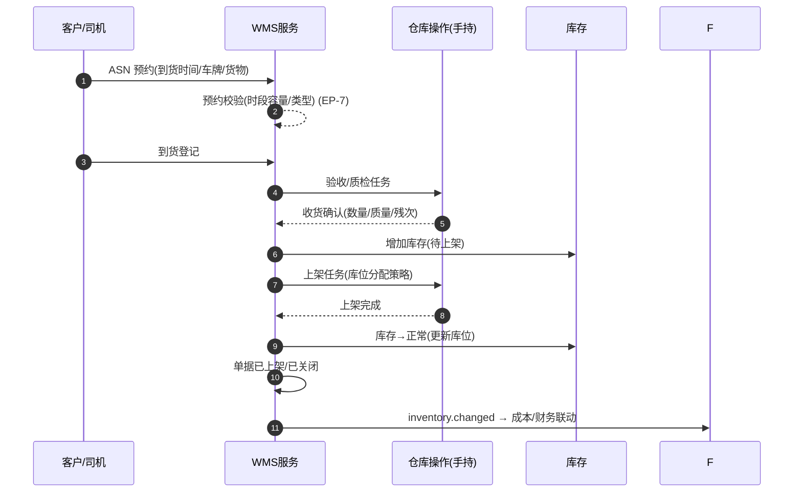

# 仓储（WMS）深化设计 v4.0

> 依据：`13-第二轮深化设计-总览` 第二节模板；基线：`09-仓储业务细化-v3.0`、`02/八`.
> 本轮重点：**入库/出库/库存/调拨/盘点作业状态机、收发货作业时序、波次与拣货策略、增值服务扩展点、EP-7**。

---

## 一、目标与范围再确认

WMS 是物理库存与成本结转的枢纽。v4 强化四件事：

1. 入库、出库、库存、调拨、盘点五套**作业状态机转换表**。
2. **收发货作业时序**（ASN 预约→验收→上架 / 出库指令→波次→拣货→复核→打包→发运）。
3. **库存唯一性**（SKU×批次×库位×所有者×状态）与数量/冻结/效期规则、预警。
4. 登记 **EP-7** 与增值服务（打托/贴标/换包装/分拣）作业钩子。

---

## 二、端到端时序图

### 2.1 入库主时序



### 2.2 出库主时序

```
出库指令 → 波次规划(拣货策略) → 拣货任务 → 扫码拣货 → 复核(称重/拍照)
   → 打包(换箱/加固) → 贴标 → 出库登记 → 装车发运 → 运单/跟踪 → 签收
   （缺货/残次→差异处理；复核异常→复核ing 返工）
```

---

## 三、状态机转换表（五套）

### 3.1 入库（Inbound）— 沿用 v3 七态

| 始态 | 终态 | 触发 | 守卫 | 动作 | 事件 | 权限 |
| --- | --- | --- | --- | --- | --- | --- |
| 待到货 | 部分到货 | 分批到货 | 预约有效 | 记录差异 | `inbound.partial` | 仓库 |
| 待到货/部分到货 | 已到货 | 全部到货 | 无 | 进入验收 | `inbound.arrived` | 仓库 |
| 已到货 | 已上架 | 上架完成 | 库位分配齐 | 库存置正常 | `inbound.stored` | 仓库 |
| 已上架 | 已关闭 | 归档 | 检查通过 | 归档 | `inbound.closed` | 仓库 |
| 各态 | 取消/退货 | 撤销、退货 | 未开始发单 | 释放预约 | `inbound.cancelled` | 仓库/主管 |
| 已到货 | 残损处理 | 质检异常 | 无 | 异常工单 | `inbound.damaged` | 仓库 |

### 3.2 出库（Outbound）

| 始态 | 终态 | 触发 | 守卫 | 动作 | 事件 | 权限 |
| --- | --- | --- | --- | --- | --- | --- |
| 待拣货 | 拣货中 | 波次下发 | 库存可分配 | 拣货任务 | `outbound.picking` | 仓库 |
| 拣货中 | 已复核 | 复核通过 | 扫码/称重一致 | 打包 | `outbound.checking` | 仓库 |
| 已复核 | 已打包 | 打包完成 | 无 | 贴标/称重 | `outbound.packed` | 仓库 |
| 已打包 | 已发货 | 出库发运 | 装车核验 | 运单/跟踪 | `outbound.shipped` | 仓库 |
| 已发货 | 已签收 | 签收事件 | 无 | 结单 | `outbound.delivered` | 系统 |
| 拣货中 | 缺货/异常 | 库存不足/残次 | 差异确认 | 补货/差异处理 | `outbound.exc` | 仓库 |
| 待拣货 | 取消 | 撤销指令 | 未拣货 | 释放库存 | `outbound.cancelled` | 仓库/主管 |

### 3.3 库存状态（SKU×批次×库位×所有者×状态）

| 状态 | 含义 | 可出库 |
| --- | --- | --- |
| 正常 | 可用 | ✅ |
| 冻结 | 特殊原因不可用 | ❌ |
| 待检 | 待检验 | ❌ |
| 过期 | 超效期 | ❌ |
| 残损 | 已损坏 | ❌ |

> 库存唯一性＝`sku+批次+库位+owner+status`，保证 FIFO/FEFO、效期预警与成本批次口径一致。

### 3.4 调拨（Transfer）核心转换

| 始态 | 终态 | 触发 | 守卫 | 动作 |
| --- | --- | --- | --- | --- |
| 草稿 | 待出库 | 提交调拨 | 库存充足 | 冻结在途 |
| 待出库 | 已出库 | 出库登记 | 无 | 转在途 |
| 在途 | 已入库 | 目标入库确认 | 验收 | 库存落位 |
| 待出库/在途 | 取消/异常 | 撤销、差异 | 审批 | 释放冻结 |

### 3.5 盘点（Count）核心转换

| 始态 | 终态 | 触发 | 守卫 | 动作 |
| --- | --- | --- | --- | --- |
| 草稿 | 盘点中 | 冻结范围 | 无 | 冻结盘点库存 |
| 盘点中 | 已提交 | 录入完成 | 无 | 生成差异 |
| 已提交 | 已调整 | 差异审核 | 审批 | 库存增减、审计 |
| 已提交 | 已关闭 | 无差异 | 无 | 归档 |

---

## 四、字段联动与计算规则

| 场景 | 规则 |
| --- | --- |
| 上架策略 | SKU/批次/库位类型匹配 |
| 拣货策略 | 单拣/波次/批次/SKU + FIFO/FEFO |
| 效期/库龄 | 30/15/7 天分级预警 |
| 库存预警 | 上/下限、残损、满仓禁约 |
| 批次成本 | 按批次归集，结转至财务（`07/inventory.changed`） |
| 增值服务 | 打托/贴标/换包装/分拣作为作业任务挂单 |

---

## 五、领域事件进出清单

| 事件 | 方向 | 说明 |
| --- | --- | --- |
| `inbound.arrived/stored/closed` | 发布 | 财务、通知、跟踪 |
| `outbound.shipped/delivered` | 发布 | 跟踪、财务、客户通知 |
| `inventory.changed` | 发布 | 财务成本结转、预警、调拨 |
| `inventory.frozen/expired` | 发布 | 可用性、效期预警 |
| `inventory.cycle_count` | 发布 | 盘点差异、审计 |
| `order.confirmed` / `booking.confirmed` | 订阅 | 触发入库预约/出库指令 |

---

## 六、可扩展点与参数化（EP-7 聚焦）

| 扩展点 | 时机 | 可插入能力 | 作用域 |
| --- | --- | --- | --- |
| 收/放货前后（EP-7） | 入库/出库 | 质检、计量、拍照、增值服务 | 仓库×货物 |
| 库位分配 | 上架 | 自定义策略（中臂/商品特性） | 仓库 |
| 波次与拣货 | 出库 | 波次/拣货策略可配 | 仓库/货主 |
| 增值服务 | 库内作业 | 新服务注册为作业模板 | 仓库/客户 |
| 预警规则 | 库存 | 效期/库龄/上下限阈值 | 仓库/SKU |
| 海外仓对接 | 调拨/FBA | 适配器+批次映射 | 海外仓/渠道 |

### 6.1 参数化建议

| 参数 | 默认 | 说明 |
| --- | --- | --- |
| `wms.asn_slot_before_h` | 72h | 入库预约提前期 |
| `wms.pick_batch_max` | 50 | 波次最大单数 |
| `wms.stock_low_alert` | 可配 | 库存下限 |
| `wms.expiry_alert_days` | 30/15/7 | 效期预警 |
| `wms.check_weight_tol` | 2% | 复核称重容差 |
| `wms.photo_required` | true | 收发货拍照 |

---

## 七、异常补充、指标口径、待 V5 深化项

### 7.1 异常补充

| 场景 | 处理 |
| --- | --- |
| 到货差异 | 部分到货+差异记录+异常处理 |
| 缺货 | 补货/替代/通知 |
| 残损/过期 | 冻结+减值+处置 |
| 满仓 | 禁约+转仓建议 |
| 温控异常（冷库） | 特异工单联动（07） |
| 海外仓差异 | 跨境对账+批次追溯 |

### 7.2 指标口径

| 指标 | 口径 |
| --- | --- |
| 入库/出库时效 | 指令→完成 时长 |
| 库存准确率 | 盘点差异率 |
| 上架/拣货效率 | 单小时任务量 |
| 效期损耗率 | 过期破损占比 |
| 库容利用率 | 已用/可配 |
| 增值服务交付率 | 按时完成占比 |

### 7.3 待 V5 深化项

- 库位级 RFID/扫码/视觉收货与自动化设备对接。
- FBA/海外仓多仓库存视图与头程+末端融合成本。
- 批次全链路（生产→入仓→出库→签收）追溯与召回。
